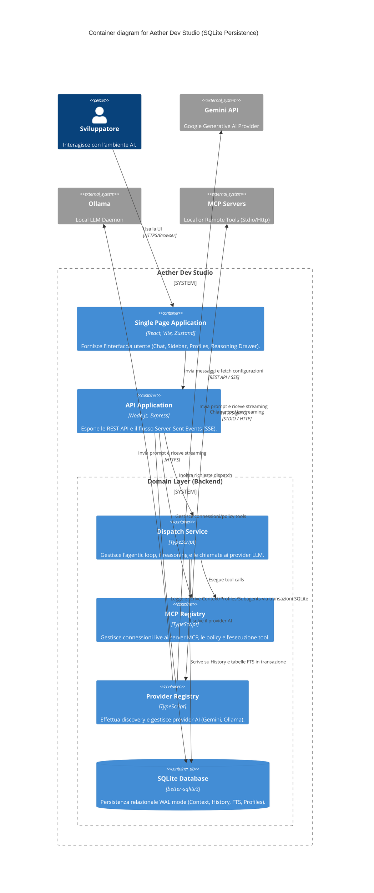

# Code Review: Aether Dev Studio (SQLite & FTS Edition)

## 1. Diagramma Architetturale C4 (Container Level)

---

## 2. Analisi Backend e Persistenza Relazionale (SQLite)

### `DatabaseHandle` e `better-sqlite3` (Eccellente)
Il precedente utilizzo di JSON lenti e basati su code in-memory è stato interamente soppiantato da un'architettura **SQLite** relazionale matura:
- **Pragmas Ottimali:** Nel file `database.ts`, SQLite è aperto con le pragma `journal_mode = WAL`, `foreign_keys = ON` e `synchronous = NORMAL`. Questa è l'impostazione "gold standard" per SQLite: garantisce concorrenza tra lettori multipli e l'unico scrittore, riducendo l'I/O bloccante e prevenendo corruzione di dati.
- **Transazioni Esplicite:** In tutti gli stores (es. `ContextStore.writeAll`, `HistoryStore.append`), le scritture multiple avvengono in transazioni tramite `db.transaction(() => { ... })()`. L'intera scrittura (es. messaggio + reasoning steps + FTS + aggiornamento sessione) è **completamente atomica**. 
- **Full-Text Search (FTS):** In `HistoryStore`, è stata integrata la scrittura speculare su tabelle virtuali FTS (`INSERT INTO messages_fts`). Questo garantisce ricerche ultra-rapide nello storico e prepara il terreno per Retrieval-Augmented Generation locale.

### `McpRegistry` e Lifecycle Connessioni
- L'utilizzo nativo di MCP è integrato in maniera solida: implementa logiche di riconnessione a *exponential backoff* in caso di disconnessioni di processi nativi.
- **Sandbox Sicura:** Il registro implementa le logiche di Auto-Approve o `awaitDecision` ritardando asincronamente i tool "pericolosi" in attesa dell'input utente.

### `DispatchService` (Agentic Loop & Streaming)
- Motore core che instrada stream multi-provider (tra LLM Gemini / Ollama e il frontend React via **Server-Sent Events**).
- Supporta il **Function Calling (Tools) Iterativo**: quando l'AI desidera usare un MCP Tool, il loop lo esegue, aspetta l'output, lo accoda e reinvia all'AI finché l'esecuzione non termina, limitando ragionevolmente il numero di chiamate consecutive a 10 per prevenire loop viziosi (`MAX_TOOL_CALLS_PER_DISPATCH`).

---

## 3. Analisi Frontend e Gestione di Stato

### Architettura State (Zustand & React)
- Lo stato globale frontend è saggiamente isolato: `useChatStore` gestisce unicamente lo stream di chat e reasoning in tempo reale, mentre gli altri store gestiscono impostazioni durature.
- Lo streaming UI avviene mediante un approccio ottimistico (l'aggiornamento parziale `text = m.text + chunk` direttamente sull'array messages). Con `better-sqlite3` a fungere da source of truth backend, la perdita della pagina durante il fetch causerà un recupero quasi istantaneo al ricaricamento (poiché la scrittura DB avviene on-done/on-stream server side o, nel caso peggiore, parzialmente fino al fault).

---

## 4. Riepilogo Code Quality & Sicurezza
1. **Linter e Type-safety:** Il passaggio allo schema relazionale non ha compromesso il pattern Domain-Driven Design (DDD). Gli store continuano a esporre interfacce TypeScript strict al resto del codice.
2. **Sicurezza Dati:** Foreign key constraint delegate a SQLite (`foreign_keys = ON`). Questo impedisce ad un bug futuro o manual query di creare "messaggi fantasma" per sessioni cancellate. Precedentemente con il file JSON, questo non era garantito a livello di engine di database.

## 5. Conclusioni (Post-Refactoring)
L'introduzione di `better-sqlite3` eleva Aether Dev Studio da tool hobbistico ad applicazione robusta "production-ready". I colli di bottiglia legati a I/O di grandi file JSON (es. history troppo lunghe e continue deserializzazioni) sono risolti per design. L'architettura supporta brillantemente casi d'uso Enterprise come RAG e ricerche veloci cross-session.
