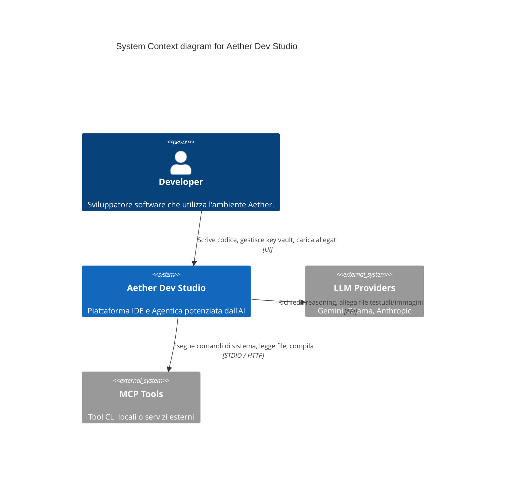
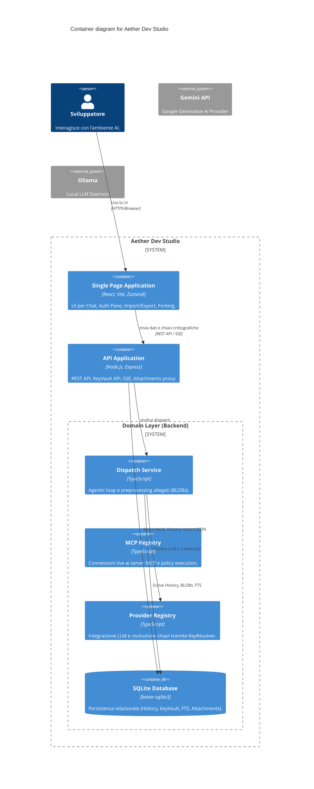

# Audit Completo: Aether Dev Studio (Slices 16-20 Edition)

Questo documento espone i risultati dell'analisi architetturale end-to-end della codebase di Aether Dev Studio, aggiornato con le più recenti macro-funzionalità di produzione (Slices 16-20).

---

## Diagrammi Architetturali (C4 Model)

### 1. System Context Diagram

### 2. Container Diagram

---

## 1. Nuove Capacità Avanzate (Slices 16-20)

### 1.1 Gestione Sicura Credenziali: `KeyVaultService` (Slice 17-18)
- Il sistema ha introdotto un **KeyVault** interno basato su SQLite.
- **Risoluzione Ibrida:** La classe `KeyResolver` usa un fallback stratificato. Cerca prima la variabile d'ambiente (es. `process.env.GEMINI_API_KEY`) per deployment "12-factor", e se assente fallbacksul Vault in-app configurato dall'utente tramite il **Provider Auth Pane**.
- **UX Security:** Il frontend gestisce esplicitamente il flusso di salvataggio/rimozione chiavi per permettere sessioni sicure anche a utenti sprovvisti di env-vars a livello OS.

### 1.2 Gestione Allegati (Slice 20)
- Il DB SQLite è stato espanso con la migrazione `005_message_attachments.sql`.
- **Fisicità:** I file (immagini e documenti testo) vengono immagazzinati direttamente come BLOB (`bytes`) legati per foreign key al `message_id`. L'engine SQLite supporta eccellentemente BLOB di media taglia, mantenendo compattezza (1 solo file) e garantendo transazionalità.
- **Preprocessing:** Il `DispatchService` normalizza gli allegati testo inserendoli come blocchi Markdown `fenced` nel corpo del prompt, e spinge gli allegati immagine tramite payload multimodali diretti (ove supportati dal provider, es. Gemini/Anthropic).

### 1.3 Forking & Token Meter (Slice 19)
- **Time-Travel / Forking:** `HistoryStore.forkSession()` implementa una sofisticata clonazione transazionale del DB. Tronca la timeline virtuale al `fromMessageId` clona l'intero set (inclusi gli idenitificatori univoci UUID) e propaga le foreign-keys degli allegati in modo atomico. 
- La protezione "NO_FORK_POINT" impedisce fork incoerenti (es. derivati da messaggi orfani del modello senza contesto utente).

### 1.4 Portabilità: Export/Import JSON (Slice 16)
- **JSON Envelopes:** Introdotto il layer per estrarre integralmente l'albero di dipendenze (messaggi, FTS, reasoning steps, tool calls) in un raw JSON (`ExportEnvelope`). Il reverse proxy reidrata (`importSession`) lo schema SQL mantenendo intatte le associazioni, utilissimo per il backup locale o per la condivisione di prompt-chain riproducibili.

---

## 2. Architettura Storica Consolidata (Frontend & Backend)

### 2.1 State Management e UI (Zustand & SSE)
Lo streaming `useStreamingDispatch.ts` mantiene l'app leggera. Nonostante l'aggiunta del Token Meter, la reattività dell'interfaccia non è compromessa poiché gli update viaggiano confinati in subset di stato Zustand (`messages` vs `mcpStore`), e intercettano il chunking SSE in tempo reale. L'aggiunta di HMR disabilitata via env-var `DISABLE_HMR` permette code-editing aggressivo senza reload invadenti.

### 2.2 Database & Transazioni SQL
Tutta l'infrastruttura si affida all'implementazione `better-sqlite3` con transazioni `db.transaction()` strict. Le Foreign Keys (`PRAGMA foreign_keys = ON`) sono l'ancora di salvezza principale che previene orfani durante l'eliminazione a cascata (`ON DELETE CASCADE`) delle sessioni o dei messaggi forkati.

---

## Conclusioni
L'app Aether, con le nuove Slices (16-20), supera lo status di *esperimento* ed entra ufficialmente in quello di **Piattaforma di Produttività Sicura**.
- La persistenza BLOB degli allegati evita problemi legati a dischi locali effimeri.
- Il KeyVault porta comodità per chi non lavora da terminale.
- Le funzionalità di import/export & fork abilitano l'uso del tool come vero e proprio "prompt engineering workbench".
