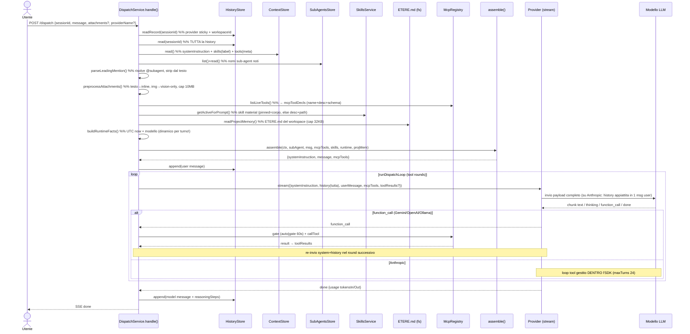
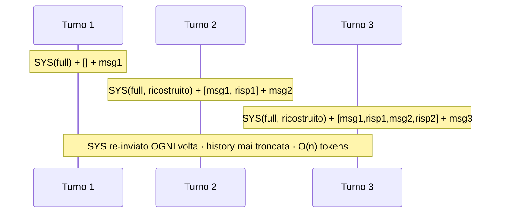

# Indagine sull'utilizzo del contesto nella chat di Aether

> Analisi di cosa viene effettivamente inviato al modello ad ogni dispatch, per
> casi d'uso. Basata sulla lettura di `DispatchService.handle()`/`resume()`
> (`server/domain/dispatch/dispatch.service.ts`), dell'assemblatore
> `assemble()` (`server/domain/dispatch/prompt-assembler.ts`), del provider
> Anthropic (`server/domain/dispatch/providers/anthropic.provider.ts`) e dei
> moduli di contorno (skills, project memory, attachments).

---

## Come Aether costruisce il contesto: il quadro generale

Il punto chiave da capire subito è che **Aether non mantiene un "contesto vivo"
lato modello**: ad ogni messaggio ricostruisce *da zero* l'intero payload e lo
rispedisce. Non c'è finestra scorrevole, né riassunto, né caching del prompt.
Il payload inviato al provider ha sempre tre componenti
(`RunDispatchLoopOpts` in `dispatch.service.ts:108`):

| Componente | Cosa contiene | Origine nel codice |
|---|---|---|
| `systemInstruction` | system base + runtime + project memory + skills + (eventuale) sub-agent | `assemble()` in `prompt-assembler.ts:97` |
| `history` | **tutti** i messaggi precedenti (user+model), non troncati | `prior.map(...)` in `dispatch.service.ts:529` |
| `userMessage` | messaggio corrente (mention rimossa, allegati testuali inlined) | `assembled.message` + `inlineTextAttachments` |
| `mcpTools` | dichiarazioni tool MCP live (nome+descrizione+schema) | `mcpToolDecls` in `dispatch.service.ts:476` |
| `attachments` | solo immagini, solo se il provider ha `vision` | `dispatch.service.ts:504` |

### Insight

- **`ctx.tools` NON viene inviato al modello.** Nell'oggetto `AssembledPrompt`
  esistono `tools` *e* `mcpTools`, ma `runDispatchLoop` passa al provider solo
  `mcpTools` (`dispatch.service.ts:533`). I "Tool" del context
  (`{id,name,version,status}`) sono solo metadati di UI/registro: le uniche
  funzioni che il modello può davvero chiamare sono i **tool MCP live**.
- **Il runtime è dinamico per turno.** `buildRuntimeFacts`
  (`dispatch.service.ts:138`) inietta `Current time (UTC)` + `Active model` ad
  ogni dispatch — quindi *anche con sistema identico, il prompt cambia ad ogni
  turno* (l'orario), il che da solo impedirebbe un cache hit esatto.
- **Skills a "progressive disclosure".** Solo le skill *pinned* hanno il corpo
  `SKILL.md` inlinato; le non-pinned mandano solo `nome: descrizione` + il path
  su disco, lasciando che il modello legga il file via tool filesystem se serve
  (`prompt-assembler.ts:41`).

---

## Anatomia del `systemInstruction` (ordine di assemblaggio)

Da `assemble()` → `withRuntimeContext()` → `withSkillsBlock()`, i blocchi
vengono concatenati con `\n\n` in quest'ordine:

```
<ctx.systemInstruction>                          ← sempre
# Sub-agent: <name>\n<subAgent.systemInstruction> ← solo se @mention risolta
# Runtime\nCurrent time (UTC): …\nActive model: … ← sempre
# Project memory (ETERE.md)\n<ETERE.md>          ← solo se esiste nel workspace (cap 32KB)
# Active Skills
- <label skill>                                  ← skill "context" abilitate (solo nome)
- <material skill>: <description>                ← skill su disco non-pinned (nome+desc+path)
## Skill: <name>\n<corpo SKILL.md completo>       ← skill pinned (corpo intero inlinato)
```

---

## Matrice per casi d'uso (cosa parte davvero)

Legenda: ✅ inviato · ➖ assente · 🔁 ricostruito e re-inviato ogni volta

| # | Caso d'uso | system base | runtime | ETERE.md | skills block | sub-agent | tool MCP | history | note token |
|---|---|---|---|---|---|---|---|---|---|
| **A** | 1° prompt minimale (no skill/MCP/subagent) | ✅ | ✅ | se presente | ➖ | ➖ | ➖ | vuota | minimo |
| **B** | 1° prompt, skill abilitate | ✅ | ✅ | se presente | ✅ | ➖ | ➖ | vuota | +descr (o +corpo se pinned) |
| **C** | 1° prompt, server MCP online | ✅ | ✅ | se presente | ✅/➖ | ➖ | ✅ schema completo | vuota | +N schemi tool |
| **D** | 1° prompt con `@subagent …` | ✅ | ✅ | se presente | ✅ (label+subagent.skills) | ✅ | ✅ | vuota | +instr subagent |
| **E** | 1° prompt con allegati | ✅ | ✅ | se presente | … | … | … | vuota | testo→fenced nel msg; img→solo se vision |
| **F** | **2° prompt stessa sessione** | 🔁 | 🔁 (orario nuovo) | 🔁 | 🔁 | 🔁 (solo se ri-menzioni) | 🔁 | **tutto lo storico** | cresce O(n) |
| **G** | Loop tool dentro un dispatch | (vedi sotto) | | | | | ✅ | accumulato | re-invio per round (non-Anthropic) |
| **H** | Resume messaggio interrotto | ✅ | ✅ | se presente | ➖ **assente** | ➖ **assente** | ✅ | fino al msg interrotto | system "leggero" |

### Dettagli non ovvi per caso

**Caso D (sub-agent).** La mention deve essere *in testa* al messaggio
(`parseLeadingMention`) e viene **rimossa** dal testo inviato
(`mention.stripped`). Il sub-agent contribuisce: la sua `systemInstruction`
(blocco `# Sub-agent`), le sue `skills` (fuse nelle label), i suoi `tools`
(fusi in `ctx.tools` → **ma ancora una volta non inviati al modello**, solo
metadati). Quindi un sub-agent in pratica cambia *solo system instruction +
lista nomi skill*.

**Caso F (secondo prompt).** Questo è il punto più importante per i costi:
`historyStore.read()` restituisce **l'intera sessione senza troncamento** e
viene rispedita per intero (`dispatch.service.ts:393,529`). Inoltre **il
sub-agent NON è sticky**: se al 1° turno hai scritto `@reviewer …` ma al 2° no,
il blocco sub-agent sparisce. Idem per le skill: vengono rilette dallo stato
corrente ad ogni turno, quindi togglarle tra un messaggio e l'altro cambia ciò
che parte.

**Caso G (loop tool nel singolo dispatch).** Qui c'è una divergenza forte tra
provider:

- **Anthropic** (`anthropic.provider.ts`): passa `runToolCall` all'SDK e il
  loop multi-step avviene *dentro* l'SDK (`maxTurns: 24`). Aether chiama
  `stream()` **una sola volta**; i re-invii alla API li gestisce l'SDK
  internamente.
- **Gemini / OpenAI / Ollama**: emettono un chunk `function_call`, Aether esce
  dallo stream, esegue il tool, e **richiama `provider.stream()`** con i
  `toolResults` (`dispatch.service.ts:271-337`). Ogni round **re-invia system +
  history + testo accumulato** → la crescita di token per dispatch con molti
  tool è significativa.

**Caso H (resume).** Percorso volutamente più magro
(`dispatch.service.ts:697`): usa `withRuntimeContext` *senza* `withSkillsBlock`
e *senza* sub-agent. Quindi su un resume il modello perde il blocco skill e
l'identità del sub-agent — asimmetria da tenere a mente.

---

## Specificità del provider Anthropic (importante)

Aether usa il `@anthropic-ai/claude-agent-sdk`, che in input streaming accetta
**solo messaggi `role:'user'`**. Conseguenza (`anthropic.provider.ts:220`
`renderConversation`): **tutta la history + il messaggio corrente vengono
appiattiti in UN UNICO messaggio user di testo**:

```
# Conversation so far
User: …
Assistant: …
User: …

<userMessage corrente>
```

### Insight

- **Niente struttura dei turni su Anthropic.** I turni assistant passati non
  sono "veri" turni API ma testo trascritto dentro un blocco. Questo cambia
  come il modello "vede" la conversazione rispetto agli altri provider.
- **Isolamento forte:** `tools: []` e `settingSources: []`
  (`anthropic.provider.ts:93`) disabilitano i tool nativi del `claude` spawnato
  e impediscono che skill/CLAUDE.md dell'host "trapelino". Il modello vede
  *solo* il systemPrompt e i tool MCP di Aether.
- **Nessun prompt caching configurato.** Non viene impostato alcun
  `cache_control`; sommato al runtime-clock variabile, ogni turno è input nuovo
  da pagare per intero.

---

## Sequence diagram — flusso di un dispatch



## Crescita del contesto nei turni (perché conta)



---

## Cambio modello a runtime

Nella chat puoi cambiare modello mentre la sessione è in corso. Due strade,
entrambe convergono sulla stessa risoluzione in `dispatch.service.ts:376-380`:

- **Sticky per sessione**: il TopBar fa `PATCH /api/history/:id` →
  `setProviderName` (`history.store.ts:127`), che scrive `provider_name` sulla
  riga della sessione.
- **Override per richiesta**: il body del dispatch può portare un
  `providerName` puntuale.
- Precedenza: `request.providerName ?? session.providerName ?? registry.default`.

Il punto cruciale è **cosa NON cambia** quando switchi: la history su SQLite.

### Impatto sul context consumption

**1. La history è provider-agnostica → il nuovo modello eredita tutto.**
I messaggi sono salvati come `{ role, text }` puri (`history.store.ts`), senza
tag di provenienza. Al dispatch successivo, `prior.map(m => ({role, text}))`
rispedisce **l'intero transcript**, incluso il testo generato dal modello
precedente, al nuovo modello come **input tokens**. Cambiare modello **non
resetta né alleggerisce** il contesto: paghi di nuovo tutta la storia,
semplicemente con un tokenizer diverso.

> **Insight**
> - **Stesso transcript, costo diverso.** Ogni modello tokenizza diversamente,
>   quindi i `tokensIn` riportati (dall'`usage` del provider,
>   `dispatch.service.ts:597`) variano a parità di conversazione. Non c'è alcun
>   conteggio token lato Aether: nessun budget client-side.
> - **Nessuna consapevolezza della context window.** Niente troncamento. Una
>   sessione lunga che sta nella finestra di un modello può **andare in
>   overflow** passando a un modello con finestra più piccola (es. switch da un
>   1M-context a un 128k), perché la history viene rispedita intera comunque.

**2. Re-packaging diverso passando da/verso Anthropic.**
Gli altri provider mandano turni strutturati; Anthropic appiattisce tutto in
**un unico messaggio `user`** (`anthropic.provider.ts:220` `renderConversation`).
Lo stesso storico salvato viene quindi *impacchettato diversamente* a seconda
del modello attivo al momento del dispatch — conta per come il modello "legge"
il contesto, non solo per i token.

**3. Capabilities divergenti cambiano cosa entra nel payload.**

| Provider | vision | thinking |
|---|---|---|
| anthropic / gemini / openai | ✅ | ✅ |
| ollama | ➖ | ➖ |

- **Immagini**: gli allegati immagine del messaggio corrente partono solo se
  `provider.capabilities.vision` (`dispatch.service.ts:504`). Switchando a
  Ollama, le immagini che alleghi vengono **silenziosamente droppate**
  (`providerAttachments = []`). Nota collaterale: le immagini dei messaggi
  *passati* non vengono **mai** re-inviate nella history (solo testo) — quel
  pezzo di contesto è già perso indipendentemente dal modello.
- **Thinking**: su Ollama il flag thinking non produce nulla; su Anthropic
  abilita un budget di 8000 token (`anthropic.provider.ts:107`), che incide
  sull'output consumption.

**4. Il runtime fact riflette il nuovo modello.**
`buildRuntimeFacts` inietta `Active model: <providerName>` nel blocco
`# Runtime` (`dispatch.service.ts:138`): il system instruction cambia
testualmente al cambio modello.

**5. I tool MCP restano invariati.**
Le dichiarazioni tool dipendono dai server MCP online, non dal modello — quindi
switchare modello non cambia il set di tool dichiarati (a parità di server
connessi).

### In sintesi

Cambiare modello a runtime **non è un'operazione "leggera" sul contesto**: il
nuovo modello riparte con l'intero storico ricostruito come input fresco, ma con
tokenizer, finestra di contesto e capabilities propri. I rischi concreti sono
**overflow** passando a finestre più piccole e **perdita silenziosa di input**
(immagini) passando a provider non-vision. Il costo si materializza al primo
dispatch dopo lo switch, non al momento del cambio nel TopBar.

---

## Conclusioni operative

1. **Il system instruction si paga ad ogni turno**, intero. Se hai molte skill
   *pinned* o un ETERE.md grande, quel costo si moltiplica per il numero di
   messaggi.
2. **La history non viene mai potata né riassunta** → le sessioni lunghe
   crescono linearmente fino al limite della finestra del modello (nessuna
   gestione esplicita: rischio di errori "context length" su sessioni molto
   lunghe).
3. **`ctx.tools` non è contesto reale per il modello** — solo i tool MCP live
   lo sono. Disabilitare/abilitare server MCP è ciò che cambia davvero le
   capability del modello.
4. **Sub-agent e skill sono per-turno**, non sticky: vanno rievocati. Il
   `resume` per giunta li omette del tutto.
5. **Nessun prompt caching** + runtime-clock variabile ⇒ ogni turno è input
   "fresco". Se i costi/latency contassero, i candidati naturali per
   un'ottimizzazione sono: caching del prefisso stabile del system su Anthropic,
   e una strategia di troncamento/riassunto della history.
