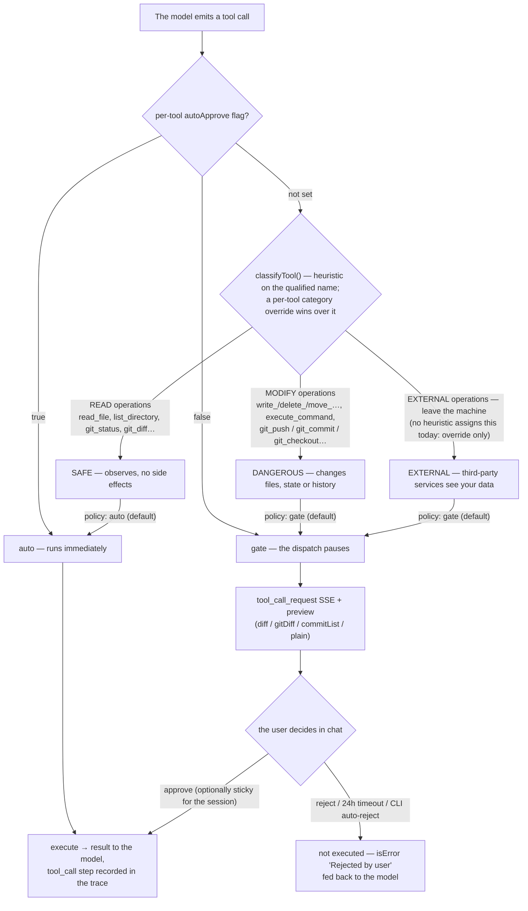

# Breakpoints

What this covers: the approval gate that sits in front of every MCP tool call. Read this when you're changing tool-call policy, debugging why a tool call hangs or gets auto-rejected, or building UI around the approve/reject flow.

## How it works

Every tool call the model wants to make is classified into one of three categories — `safe`, `dangerous`, `external` (`ToolCategory` in `server/domain/mcp/breakpoints/breakpoints.types.ts`) — by `classifyTool()` (`server/domain/mcp/breakpoints/classify.ts`), using name patterns (`DANGEROUS_NAME_PATTERNS`: write/edit/delete/execute_command/git rebase-push-reset, etc.) and, for shell calls, argument patterns (`DANGEROUS_SHELL_PATTERNS`: `git push -f`, `npm publish`, `git reset --hard`, `git rebase`, raw disk writes). A per-tool policy override (`McpToolPolicy.category` or an explicit `autoApprove` flag) can short-circuit classification.

`BreakpointService.resolveDecision()` (`server/domain/mcp/breakpoints/breakpoints.service.ts`) turns a classified category into a mode:
1. If the tool's policy sets `autoApprove: true` → `auto`. If `autoApprove: false` → `gate`.
2. Otherwise, classify the tool and look up that category's mode in `BreakpointPolicyStore.read()` — a per-category (`safe`/`dangerous`/`external`) `auto`/`gate` setting, editable via `GET/PUT /policy/:category` (`server/routes/breakpoints.routes.ts`).

**`auto`** means the dispatch loop runs the tool immediately. **`gate`** means the dispatch loop calls `McpRegistry.awaitDecision(callId)` (`server/domain/mcp/registry.ts`), which returns a promise that resolves only when something calls `resolveDecision(callId, 'approve' | 'reject')` — or **rejects after a 24-hour timeout** (`timeoutMs = 24 * 60 * 60 * 1000`, hardcoded default parameter), at which point the pending decision is dropped and the call is treated as rejected.

The whole evaluation at a glance — **read** operations observe and run by default, **modify** operations change files/state/history and wait for you, **external** operations send data off the machine and wait for you too. Every "default" edge below is a per-category radio in the sidebar (auto/gate), and the per-tool override can reroute any single tool:

**Preview / diff UI**: before waiting on the decision, `DispatchService.gateExecuteAndTrace()` (`server/domain/dispatch/dispatch.service.ts`) computes a preview via `PreviewService.previewToolCall()` (`server/domain/mcp/breakpoints/preview.service.ts`) — one of `diff` (old/new text + path), `gitDiff` (unified diff + title), `commitList`, or `plain` (`PreviewResult` in `breakpoints.types.ts`) — and emits it on the `tool_call_request` SSE event so the UI can render the right approval widget (e.g. a diff view for a file write, a commit list for a git operation) before the user decides.

**CLI behavior**: the CLI client has no interactive approval prompt. When a gated call comes through, `rejectDecision()` (`cli/client.ts`) proactively POSTs `{ callId, action: 'reject' }` to `/api/mcp/decision` (best-effort — a failed reject call must never crash the stream) rather than leaving the call to expire on the 24-hour timeout. Interactive approve/reject is web-UI only.

**SSE interaction**: `gateExecuteAndTrace()` emits `tool_call_request` (fire immediately, carrying the preview) then blocks on the gate decision; once resolved (approve → execute, or reject/timeout → `{ ok: false, error: 'Rejected by user' }`), it emits `tool_call_result` and records a `tool_call` step in the `ReasoningTracer`. The dispatch SSE stream stays open across the wait, so a long gate pause simply delays `tool_call_result`, not the connection itself.

## Key files

- `server/domain/mcp/breakpoints/classify.ts` — `classifyTool`, dangerous name/shell patterns
- `server/domain/mcp/breakpoints/breakpoints.service.ts` — `BreakpointService.resolveDecision`
- `server/domain/mcp/breakpoints/policy.store.ts` — per-category `auto`/`gate` policy storage
- `server/domain/mcp/breakpoints/preview.service.ts` — diff/gitDiff/commitList/plain preview generation
- `server/domain/mcp/registry.ts` — `awaitDecision` (24h timeout), `resolveDecision`
- `server/domain/dispatch/dispatch.service.ts` — `gateExecuteAndTrace`, the `tool_call_request`/`tool_call_result` SSE events
- `server/routes/breakpoints.routes.ts` — `/policy`, `/preview` HTTP endpoints
- `cli/client.ts` — `rejectDecision`, the CLI's auto-reject-on-gate behavior

## See also

- [MCP tools](mcp-tools.md) — where tool declarations come from and the per-dispatch call cap
- [Architecture](../architecture.md) — the dispatch loop and SSE event stream
- [API & SSE reference](../reference/api.md) — full SSE event catalog
