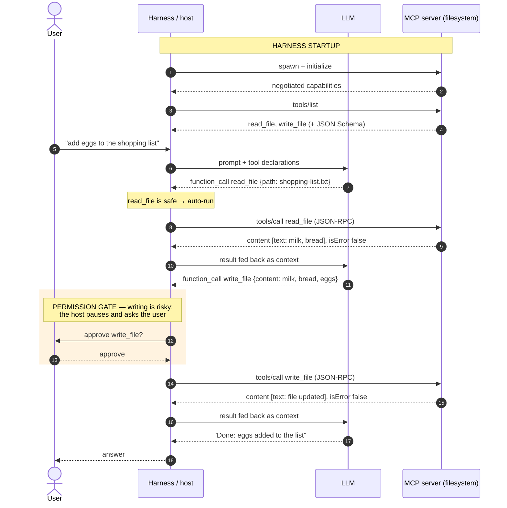
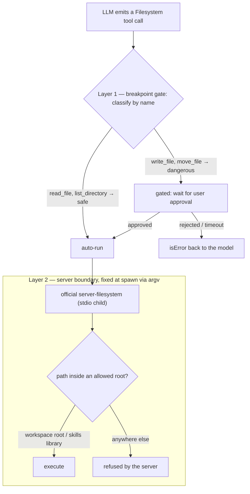
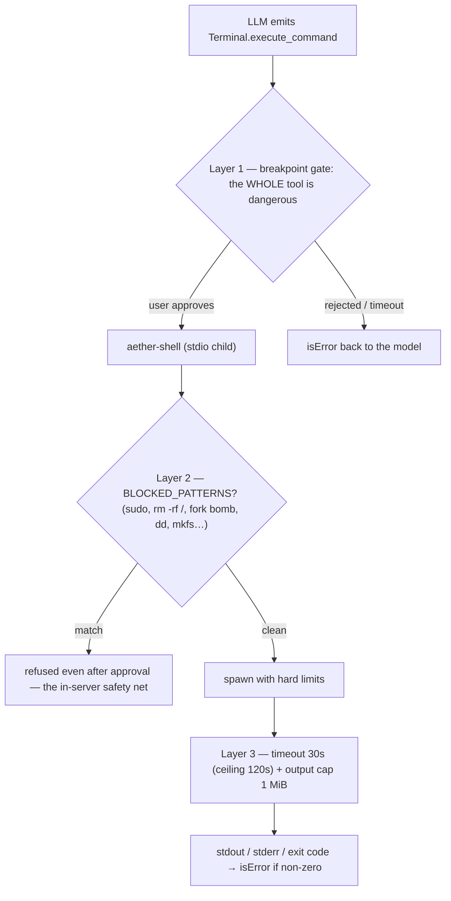
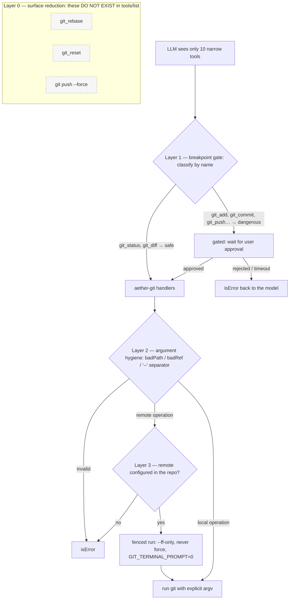

# Built-in MCP servers — a deep dive

What this covers: how the three bundled tools — Filesystem, Terminal, Git — are implemented as MCP servers, the three different implementation strategies they use, their lifecycle (per-root pooling, LRU eviction), and how the layered safety model actually works. It opens with a protocol primer (§1) and an MCP best-practice checklist (§2) that the rest of the guide keeps referring back to. Read this when you want to understand what an MCP is and how it works, when you want to understand the three built-ins beyond the overview in [MCP tools](mcp-tools.md), or before adding a fourth one.

## 1. MCP in a nutshell

The **Model Context Protocol** is an open protocol (introduced by Anthropic in late 2024, since adopted across the AI industry) that standardizes how an LLM-based application talks to external services. Before MCP, every assistant integrated every tool with bespoke implementations; with MCP, a server written once works with any compliant host.
Fundamentally it is the idea of APIs brought to the LLM world. When we type into Claude Code (sorry for always using it as the example), what really happens is that our prompt gets a list of usable tools concatenated to it, enriched with a description of what they do and how to call them. Being LLMs, that description is written in natural language. We grew up building commands with fixed arguments — and that era turns out to be useful again today.

Three roles to remember — nothing shocking, nothing new:

- **Host** — the LLM application (Aether, Claude Code, an IDE assistant). It decides *which* servers to connect and *when* a tool may run.
- **Client** — the connection object the host owns, one per server (in Aether: `StdioMcpConnection` / `HttpMcpConnection`).
- **Server** — a process or an endpoint that exposes capabilities. It knows nothing about who is querying it; it just answers.

The format used is **JSON-RPC 2.0** over a transport: **stdio** (the host spawns the server as a child process and exchanges newline-delimited JSON on stdin/stdout — the transport used by Aether's three built-in MCPs) or **streamable HTTP** (a remote endpoint; what Aether's "Add Connection" dialog configures). A session starts with a handshake — `initialize` (protocol version + capability negotiation) followed by the `notifications/initialized` notification — and then speaks the primitives:

- **Tools** — functions the *model* decides to invoke, each described by a name, a natural-language description, and a JSON Schema for its arguments. Discovered with `tools/list`, invoked with `tools/call`.
- **Resources** — data the *host* reads and injects as context (files, tables, documents).
- **Prompts** — user-invoked templates (the "slash command" primitive).

Aether's client — like most agentic hosts today — uses the **tools primitive only**: `mcp.schema.ts` validates exactly `tools/list` and `tools/call`, nothing else. That is a deliberate scope cut — as of today, this is how it's done.

The mental model to keep is that **a tool result must be prepared for the LLM, not be an API response for a piece of software**. Results are `content` blocks (usually text) plus an `isError` flag. `isError: true` means "the operation failed in a way the model must be able to read, understand and react to" (file not found, exit code 1, blocked by policy) — distinct from a JSON-RPC *protocol* error, which means the call itself was malformed.
Nothing different from REST APIs in the Richardson Maturity Model:
SYSTEM ERROR
*KO 500 = the server blew up. A system error is none of the LLM's business.*
BUSINESS ERROR
*{
  "type": "https://example.com",
  "title": "Insufficient balance",
  "status": 422,
  "detail": "Your current balance is €50.00, you cannot withdraw €100.00.",
  "instance": "/errors/tx-98765",
  "error_code": "BANK_ERR_1002"
}*
Well-designed servers reserve protocol errors for protocol problems and report domain failures as content, so an LLM in the agentic loop can recover instead of crashing.

Here is the full round-trip on a minimal example — a hypothetical filesystem MCP server started together with the harness, and the request "add eggs to the shopping list". Two things to notice: the **LLM never talks to the MCP server** (it only emits an *intention*; the host executes), and the **permission gate lives in the host**, between the model's intention and the actual call — which is why it works identically for every server, including ones you didn't write:



## 2. Best practices — and where the built-ins apply them

In the first era of MCP we heard about deleted production databases, frozen bank accounts and who knows what other damage caused by artificial intelligence. That happened because whoever designs MCP tools — and often whoever sells themselves as an AI-adoption expert — has not the slightest software development experience nor the necessary best practices, let alone security, SDLC, GDPR. **Nothing stops you from implementing your own database-access MCP so the AI can "know the structure of databases and tables" or "consume their data" — but why on earth should we allow it to wipe the whole DB?**
What follows is a checklist distilled from the MCP ecosystem's experience. Each item names the section where Aether's built-ins put it into practice — the rest of this guide is, in a sense, this table expanded.

| # | Best practice | Why | Where in Aether |
|---|---|---|---|
| 1 | **Least privilege by construction** — scope the server to the minimum set of capabilities the job needs; pass the boundaries at spawn time, not as runtime checks | A server that cannot delete a database will not delete it | Filesystem gets its allowed roots as argv (§5); git tools operate only on configured remotes (§7) |
| 2 | **Specialized tools when invariants matter, generic tools only behind gates** | N specific tools encode guarantees a description can't — you cannot just write to an AI "remember not to delete the database"; one generic tool maximizes attack surface | The whole Terminal↔Git contrast (§6 vs §7) |
| 3 | **Descriptions are prompts** — write them for the model: state limits, defaults, and refusals right in the description | The description is the only "documentation" the model sees at decision time | `execute_command` declares its timeout and cap; `git_push` says "Never force", and there is another safety layer in Aether's implementation: **the MCP does not implement the force parameter** (§6, §7) |
| 4 | **Treat arguments as adversarial** — validate types, reject flag-shaped values, use `--` separators, build argv explicitly, never interpolate into a shell string | Tool args are model-generated text; prompt injection reaches them | `badPath()`, `badRef()`, `['add', '--', ...paths]` (§7) |
| 5 | **Bound everything** — timeouts with a hard ceiling, output caps with explicit truncation markers | Protects the host's event loop *and* the model's context window | `SHELL_DEFAULTS`: 30s/120s, 1 MiB + `[output truncated]` (§6) |
| 6 | **Domain KOs are `isError` content, not protocol errors** | The model can read the failure and try something else; a protocol error just kills the exchange | Every handler returns `{ isError, content }` — blocked patterns, timeouts, non-zero exits (§6, §7) |
| 7 | **Keep per-call state in the call, session state in the host** | Stateless servers restart and scale trivially | Terminal takes `cwd` per call and is a single global instance; it is the *host* that rotates the rooted fs/git instances (§6, §8) |
| 8 | **Authorization lives in the host, not the server** | A gate outside the servers takes priority over all of them — including servers you didn't write | The breakpoint gate classifies and filters every call, built-in or custom (§9) |
| 9 | **Emit stable, machine-parseable output** | The model learns the shape once and stops guessing | `git status --porcelain=v2`; the fixed `stdout/---/stderr/---/exit` layout (§6, §7) |
| 10 | **Name tools predictably** — names are an API surface: classification, policy and UI all key on them | A tool with an explicit name can be risk-classified without executing it | `DANGEROUS_NAME_PATTERNS` works purely on qualified names (§9) |

## 3. The core idea: use your own protocol

Aether is an MCP *client*: it speaks JSON-RPC to external servers over stdio or HTTP. The three bundled tools reuse exactly that infrastructure instead of adding a parallel one: they are **ordinary stdio MCP servers that Aether spawns itself**. No privileged code path, no internal API — from the registry's point of view they are servers like any other. The only differences: the `id` starts with `builtin:` and the config does not come from the user's context — it is **synthesized** by `BuiltinMcpStore` (`server/domain/mcp/builtin/builtin.store.ts`).

The three built-in MCPs implement **three distinct implementation strategies**, and that is what makes them a good case study ;-)

| | Strategy | Spawned process | Rooted per workspace |
|---|---|---|---|
| **Filesystem** | reuse the official package | `@modelcontextprotocol/server-filesystem` | yes |
| **Terminal** | home-grown server, 1 generic tool | `server/mcp/builtin/aether-shell.ts` | **no** (global) |
| **Git** | home-grown server, 10 specialized tools (commands) | `server/mcp/builtin/aether-git.ts` | yes |

## 4. Configuration: `BuiltinMcpStore`

Persistent state is minimal — a SQLite table `builtin_mcp_state` with three rows (`transport`, `enabled`, `fs_root`). The interesting work is in `toConfigs()` / `rootedConfigs()`, which turn those rows into stdio `McpServerConfig`s ready for the registry:

```ts
{
  id: 'builtin:git@/path/to/workspace',    // ← the id embeds the root!
  transport: 'stdio',
  command: process.execPath,               // the current node
  args: [...resolveAetherGitArgs(), root],
  env: builtinNodeEnv(),
}
```

Three details here are worth the whole tutorial:

**a) `command: process.execPath`, never `"node"`.** The child uses the *same* runtime as the parent, whatever that is — crucial under Electron, where the executable is the app itself. Hence `builtinNodeEnv()`: when `process.versions.electron` exists it injects `ELECTRON_RUN_AS_NODE=1`, otherwise the spawn would open a second GUI window instead of a Node process.

**b) Dev/prod entry resolution.** In production, `dist/server/mcp/builtin/aether-shell.js` sits next to the bundle; in dev only the `.ts` source exists, and a child `node` does not inherit the parent dev server's tsx loader — it would die with `ERR_UNKNOWN_FILE_EXTENSION`. So `resolveAetherShellArgs()` returns `['--import', 'tsx', srcEntry]` in dev and `[distEntry]` in prod.

**c) The root inside the id.** `builtin:filesystem@/home/x/project` is the resource's pooling key and makes it unique and unambiguous (§8).

Two Aether-specific design notes:

- The "synthesized config" pattern keeps the built-ins **out of** `context.mcpServers`: the user cannot delete or corrupt them from the MCP dialog, and the UI manages them with dedicated toggles (`BuiltinMcpToggles`) instead of the generic server cards.
- Note the deliberate asymmetry: Filesystem always appends `libraryDir` (the skills folder) to the allowed roots, Git does not. Skills must be readable from anywhere; there is no reason for the agent to commit inside the library.

## 5. Filesystem: just import it

For files, Aether writes zero logic: `resolveFilesystemServerEntry()` resolves the **official** `@modelcontextprotocol/server-filesystem` package entry via `require.resolve` and launches it with the allowed roots as argv:

```
node …/server-filesystem/dist/index.js /workspace/root /skills/library/path
```

Safety (path traversal, symlink escape, root confinement) is delegated to the protocol's reference package, maintained and tested elsewhere. The *strategy*: when an official MCP server exists, Aether's added value is not reimplementing it but **rooting it per workspace** and classifying its tools (§9).

Two independent layers protect a Filesystem call — the host-side gate decides *whether* the call runs, the spawn-time roots decide *where it can possibly reach*. Note that the second layer is not a runtime check Aether performs: **the server was *born* unable to leave its roots (best practice #1)**:



## 6. Terminal: the minimal home-grown server

`aether-shell.ts` (100 lines) demonstrates how little a stdio MCP server is: a loop that buffers stdin, splits on newlines, `JSON.parse`s, and answers three methods — `initialize`, `tools/list` (a single tool, `execute_command`), `tools/call`. That's the whole protocol.

The valuable part is split into `aether-shell.handler.ts`, and this **protocol/handler separation is the key architectural choice**: `executeCommand()` is a pure async function testable with Vitest *in-process*, without starting the server or speaking JSON-RPC. Protocol tests and logic tests are separate. After two years of DORA-mandated coverage, we had to bring *something* home.

The handler applies three defenses, in order:

1. **Pattern blocking** (`BLOCKED_PATTERNS` in `builtin.types.ts`): `sudo`, `rm -rf /`, fork bombs, `dd if=`, `mkfs.*`, raw writes to `/dev/sd*`, `chmod -R 777 /`. On a match, the command never starts — `isError: true` naming the pattern.
2. **Timeout**: 30 s default, hard 120 s ceiling even if the model asks for more (`Math.min`), SIGTERM → SIGKILL escalation after 500 ms.
3. **Output cap**: 1 MiB per stream (stdout and stderr separately), with an `[output truncated]` marker — this protects the model's *context window*, not just memory.

Output has a fixed shape, `stdout\n---\nstderr\n---\nexit code: N`, so the model *learns* a stable structure. And of course `windowsHide: true` on the spawn, otherwise n node shell windows would pop up while you work.

Terminal is also the only built-in **started at boot** (`bootstrap()` calls `startBuiltin('terminal')`) and **never rooted**: one global process, id `builtin:terminal`, because `cwd` (current working directory) is a per-call tool argument.

Because the tool is generic, the layers stack differently than for Filesystem: the *entire* tool is classified dangerous, so **every** call waits for the user — and the in-server blocklist sits *behind* the approval, catching what must not run **even if a human said yes** (a distracted click on "approve" for `sudo rm -rf /` still does nothing):



## 7. Git: specialized tools (commands) instead of a shell

The most interesting choice is what Git is **not**: it is not `execute_command` with a `git` prefix. It is **10 specific-signature tools** (`git_status`, `git_diff`, `git_add`, `git_commit`, `git_checkout`, `git_restore`, `git_fetch`, `git_push`, `git_pull`, `git_merge`), each mapped to a handler that builds argv explicitly. The defensive strategies in `aether-git.handler.ts`:

- **Argument hygiene**: `badPath()` rejects empty paths and paths starting with `-` (no flag injection à la `--upload-pack`), and every path list goes after the `--` separator (`['add', '--', ...paths]`), so a file named `-rf` stays a file.
- **Fenced remote operations**: `gitFetch/Push/Pull` verify the remote is among those **configured in the repo** (`configuredRemotes`) — the agent cannot push to an arbitrary URL. `GIT_TERMINAL_PROMPT=0` prevents git from hanging on an interactive credential prompt.
- **No history rewriting**: `git_pull` and `git_merge` are hardcoded `--ff-only`; `git_push` "Never force" (from the tool description); `git_rebase` and `git_reset` simply do not exist. If you don't want it to delete a database, don't implement the capability.
- **Parseable output**: `git_status` uses `--porcelain=v2 --branch`, the machine-oriented format.

The Terminal↔Git contrast is a lesson: **one generic tool gains flexibility and pays in attack surface; N specific tools gain stability**. Aether uses both — the agent *could* run `git rebase` via Terminal, but there it is stopped by the breakpoint gate (§9).

Git shows the strongest form of safety: **layer 0 is what the model cannot even ask for**. `git_rebase`, `git_reset` and force-push are not gated, not blocked — they *do not exist* in `tools/list`, so no amount of prompt injection can invoke them through this server. The layers below then enrich that first net:



## 8. Lifecycle: per-root pooling with LRU eviction

The registry (`server/domain/mcp/registry.ts`) manages the rooted built-ins as a pool:

- On every dispatch, **right before executing a tool**, `ensureRootedBuiltins(root)` spawns (if not already live) the `builtin:filesystem@<root>` and `builtin:git@<root>` instances for the session's workspace — lazily, so they always inherit the correct root even if the user just changed it. Aether specifically supports working across multiple workspaces.
- A `rootedLru` list keeps roots in most-recently-used order; past the cap (`AETHER_BUILTIN_POOL_MAX`, default 8) the least-recently-used root is removed and its two processes closed. Working across many workspaces does not accumulate zombie processes.
- `invalidateRootedBuiltins()` flushes the pool when the default root changes — the next dispatch starts the tools with the current configuration.

The `qualifiedName` is the convention tying everything together: `<serverName>.<toolName>` → `Filesystem.read_file`, `Terminal.execute_command`, `Git.git_push`.

## 9. Safety is layered — pattern blocks are not the gate

This is the most important concept. `BLOCKED_PATTERNS` only stops the obvious catastrophes; the real governance is in the **BreakpointService**, outside the servers:

1. `classifyTool()` (`breakpoints/classify.ts`) assigns a category by name heuristic: `DANGEROUS_NAME_PATTERNS` marks `*.execute_command`, `*.write_*/delete_*/…`, and `*.git_(push|commit|checkout|pull|merge|…)` as **dangerous**; the rest is **safe**. The user can override per tool from the UI.
2. The per-category policy (Safe→`auto`, Dangerous/External→`gate` by default) decides whether the tool runs immediately or pauses in chat **awaiting your approval** (24h timeout).
3. For gated tools, the `PreviewService` renders a preview of the effect (`DANGEROUS_SHELL_PATTERNS` — `git push --force`, `npm publish`, `git reset --hard`, … — exists precisely to highlight risky shell commands in that preview).

So: the built-in server is *capable* of the dangerous thing; the layer above asks permission. In-server patterns are only the safety net for what must not happen *even with approval*.

Two observations:

- Classification works on the **qualified name**, not the payload — which is why the git tools are specialized. `Git.git_push` is recognizable and gateable as a name; the same push inside `Terminal.execute_command` is only gateable because `execute_command` is dangerous *wholesale*.
- This is the same gate tool calls traverse when the provider is an agentic CLI reaching back through the loopback MCP bridge: the layering pays off because it is independent of *who* invokes the tool.

## 10. Recipe: adding a fourth built-in

If you wanted a "Database" built-in tomorrow, the path traced by the existing three is:

1. **Pick the strategy**: mature official MCP server exists? → the Filesystem road. A specific domain of operations to defend? → the Git road (specific tools). Genericity needed? → the Terminal road (one tool + limits).
2. If home-grown: `server/mcp/builtin/aether-db.ts` (JSON-RPC loop, ~100 copyable lines from aether-shell) + `aether-db.handler.ts` (pure logic, tested in-process).
3. An **append-only** migration adding the `('db', 0, NULL)` row to `builtin_mcp_state` (never touch existing migrations — `012_builtin_git.sql` shows how `git` was added).
4. `BuiltinTransport` += `'db'`, a branch in `toConfigs()`/`rootedConfigs()` (with the conscious choice: rooted or global?), a `resolveAetherDbArgs()` with the dev/prod dual path, `windowsHide` and `builtinNodeEnv()`.
5. A toggle in `BuiltinMcpToggles`, and a pattern in `DANGEROUS_NAME_PATTERNS` if the tool names don't already match the heuristics.

All without touching dispatch, breakpoints, or the policy UI: the reward for making the built-ins ordinary MCP servers.

## Key files

- `server/domain/mcp/mcp.schema.ts` — the client-side protocol (`tools/list`, `tools/call`)
- `server/domain/mcp/builtin/builtin.store.ts` — configuration synthesis, dev/prod entry resolution, Electron handling
- `server/domain/mcp/builtin/builtin.types.ts` — `BLOCKED_PATTERNS`, `SHELL_DEFAULTS`
- `server/mcp/builtin/aether-shell.ts` / `aether-shell.handler.ts` — Terminal server and handler
- `server/mcp/builtin/aether-git.ts` / `aether-git.handler.ts` — Git server and handlers
- `server/domain/mcp/registry.ts` — per-root pooling, LRU eviction, tool listing/dedup
- `server/domain/mcp/breakpoints/classify.ts` + `breakpoints.types.ts` — name-based classification, danger patterns

## See also

- [MCP tools](mcp-tools.md) — the overview: connecting servers, call caps, dispatch wiring
- [Breakpoints](breakpoints.md) — the approval gate every tool call traverses
- [Workspaces](workspaces.md) — where roots come from
