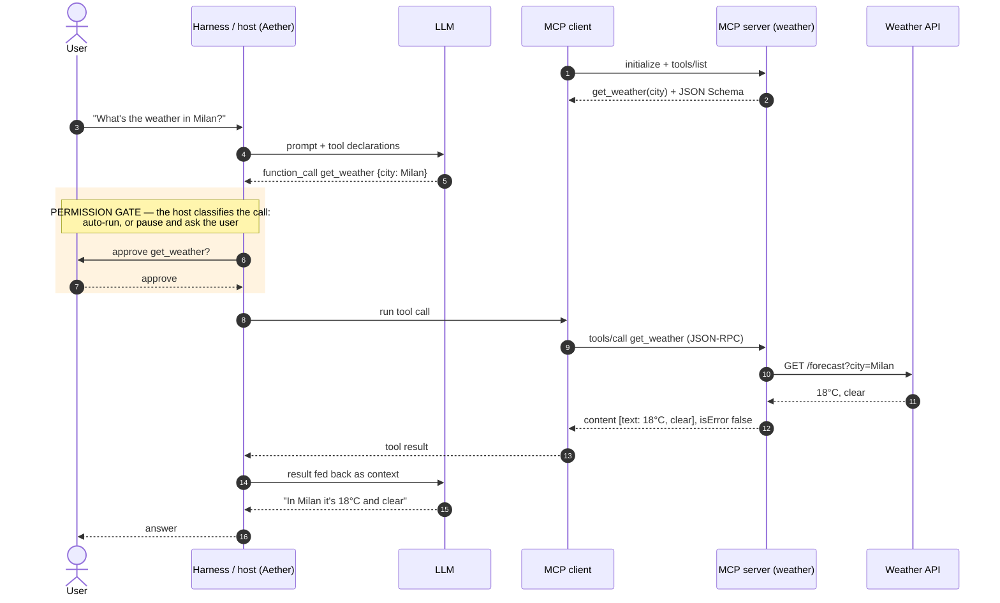
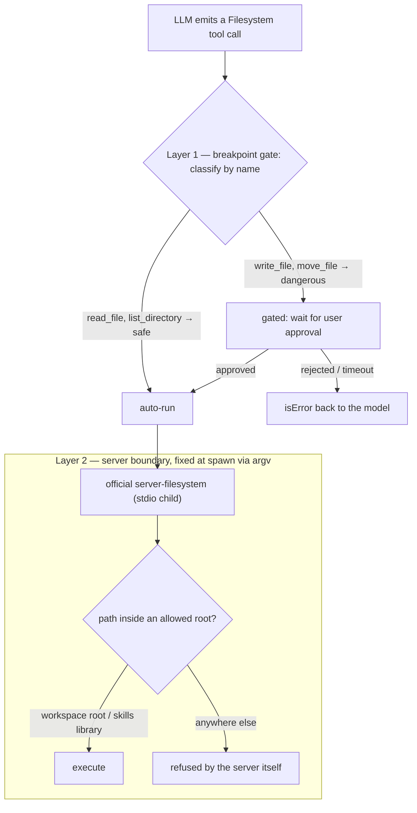
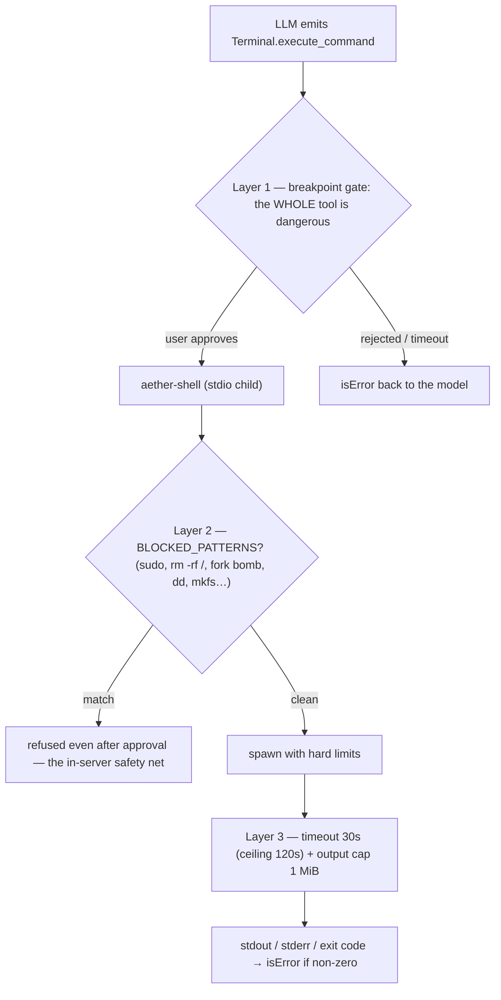
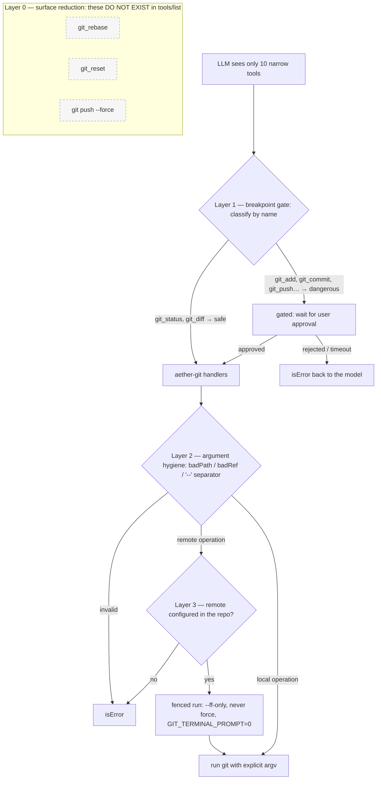

# Built-in MCP servers — a deep dive

What this covers: how the three bundled tools — Filesystem, Terminal, Git — are implemented as MCP servers, the three different implementation strategies they embody, their lifecycle (per-root pooling, LRU eviction), and how the layered safety model actually works. It opens with a protocol primer (§1) and an MCP best-practice checklist (§2) that the rest of the guide keeps referring back to. Read this when you want to understand the built-ins beyond the overview in [MCP tools](mcp-tools.md), or before adding a fourth one.

## 1. MCP in a nutshell

**Model Context Protocol** is an open protocol (introduced by Anthropic in late 2024, since adopted across the industry) that standardizes how an LLM application talks to external capability providers. Before MCP, every assistant integrated every tool with bespoke glue; with MCP, a tool server written once works with any compliant host. Three roles:

- **Host** — the LLM application (Aether, Claude Code, an IDE assistant). It decides *which* servers to connect and *when* a tool may run.
- **Client** — the connection object the host owns, one per server (in Aether: `StdioMcpConnection` / `HttpMcpConnection`).
- **Server** — a process or endpoint that exposes capabilities. It knows nothing about the model; it just answers requests.

The wire format is **JSON-RPC 2.0** over a transport: **stdio** (the host spawns the server as a child process and exchanges newline-delimited JSON on stdin/stdout — the transport all three built-ins use) or **streamable HTTP** (a remote endpoint; what Aether's "Add Connection" dialog configures). A session starts with a handshake — `initialize` (protocol version + capability negotiation) followed by the `notifications/initialized` notification — and then speaks the primitives:

- **Tools** — functions the *model* decides to invoke, each described by a name, a natural-language description, and a JSON Schema for its arguments. Discovered with `tools/list`, invoked with `tools/call`.
- **Resources** — data the *host* reads and injects as context (files, tables, documents).
- **Prompts** — user-invoked templates (the "slash command" primitive).

Aether's client — like most agentic hosts today — uses the **tools primitive only**: `mcp.schema.ts` validates exactly `tools/list` and `tools/call`, nothing else. That is a deliberate scope cut, not an accident of history.

One mental model matters more than the rest: **a tool result is data for the model, not an API response for code**. Results are `content` blocks (usually text) plus an `isError` flag. `isError: true` means "the operation failed in a way the model should read and react to" (file not found, exit code 1, blocked by policy) — distinct from a JSON-RPC *protocol* error, which means the call itself was malformed. Well-designed servers reserve protocol errors for protocol problems and report domain failures as content, so the agent loop can recover instead of crashing.

Here is the full round-trip on the canonical example — a weather tool. Two things to notice: the **LLM never talks to the MCP server** (it only emits an *intention*; the host executes), and the **permission gate lives in the host**, between the model's intention and the actual call — which is why it works identically for every server, including ones you didn't write:



## 2. Best practices — and where the built-ins apply them

A checklist distilled from the MCP ecosystem's collective experience. Each item names the section where Aether's built-ins put it into practice — the rest of this guide is, in a sense, this table expanded.

| # | Best practice | Why | Where in Aether |
|---|---|---|---|
| 1 | **Least privilege by construction** — scope a server to the narrowest capability set that does the job; pass the boundaries at spawn time, not as runtime checks | A server that never receives a capability cannot be talked into using it | Filesystem gets its allowed roots as argv (§5); git tools operate only on configured remotes (§7) |
| 2 | **Narrow tools when invariants matter, generic tools only behind hard limits** | N specific tools encode guarantees a description can't; one generic tool maximizes attack surface | The whole Terminal↔Git contrast (§6 vs §7) |
| 3 | **Descriptions are prompts** — write them for the model: state limits, defaults, and refusals right in the description | The description is the only "documentation" the model sees at decision time | `execute_command` declares its timeout and cap; `git_push` says "Never force" (§6, §7) |
| 4 | **Treat arguments as adversarial** — validate types, reject flag-shaped values, use `--` separators, build argv explicitly, never interpolate into a shell string | Tool args are model-generated text; prompt injection reaches them | `badPath()`, `badRef()`, `['add', '--', ...paths]` (§7) |
| 5 | **Bound everything** — timeouts with a hard ceiling, output caps with explicit truncation markers | Protects the host's event loop *and* the model's context window | `SHELL_DEFAULTS`: 30s/120s, 1 MiB + `[output truncated]` (§6) |
| 6 | **Domain failures are `isError` content, not protocol errors** | The model can read the failure and try something else; a protocol error just kills the exchange | Every handler returns `{ isError, content }` — blocked patterns, timeouts, non-zero exits (§6, §7) |
| 7 | **Keep per-call state in the call, session state in the host** | Stateless servers pool, restart and scale trivially | Terminal takes `cwd` per call and is a single global instance; the *host* pools rooted fs/git instances (§6, §8) |
| 8 | **Authorization lives in the host, not the server** | A gate outside the servers composes across all of them — including servers you didn't write | The breakpoint gate classifies and gates every call, built-in or custom (§9) |
| 9 | **Emit stable, machine-parseable output** | The model learns the shape once and stops guessing | `git status --porcelain=v2`; the fixed `stdout/---/stderr/---/exit` layout (§6, §7) |
| 10 | **Name tools predictably** — names are an API surface: classification, policy and UI all key on them | A well-named tool can be risk-classified without executing it | `DANGEROUS_NAME_PATTERNS` works purely on qualified names (§9) |

## 3. The core idea: eat your own protocol

Aether is an MCP *client*: it speaks JSON-RPC to external servers over stdio or HTTP. The three bundled tools reuse exactly that infrastructure instead of adding a parallel one: they are **ordinary stdio MCP servers that Aether spawns itself**. No privileged code path, no internal API — from the registry's point of view they are servers like any other. The only differences are that their `id` starts with `builtin:` and their config does not come from the user's context: it is **synthesized** by `BuiltinMcpStore` (`server/domain/mcp/builtin/builtin.store.ts`).

The three embody **three distinct implementation strategies**, which is what makes them a good case study:

| | Strategy | Spawned process | Rooted per workspace |
|---|---|---|---|
| **Filesystem** | reuse the official package | `@modelcontextprotocol/server-filesystem` | yes |
| **Terminal** | home-grown server, 1 generic tool | `server/mcp/builtin/aether-shell.ts` | **no** (global) |
| **Git** | home-grown server, 10 surgical tools | `server/mcp/builtin/aether-git.ts` | yes |

## 4. The config factory: `BuiltinMcpStore`

Persistent state is minimal — a SQLite table `builtin_mcp_state` with three rows (`transport`, `enabled`, `fs_root`). The interesting work is in `toConfigs()` / `rootedConfigs()`, which turn those rows into stdio `McpServerConfig`s ready for the registry:

```ts
{
  id: 'builtin:git@/path/to/workspace',    // ← the id embeds the root!
  transport: 'stdio',
  command: process.execPath,               // the current node
  args: [...resolveAetherGitArgs(), root],
  env: builtinNodeEnv(),
}
```

Three details here are worth the whole tutorial:

**a) `command: process.execPath`, never `"node"`.** The child uses the *same* runtime as the parent, whatever that is — crucial under Electron, where the executable is the app itself. Hence `builtinNodeEnv()`: when `process.versions.electron` exists it injects `ELECTRON_RUN_AS_NODE=1`, otherwise the spawn would open a second GUI window instead of a Node process.

**b) Dev/prod entry resolution.** In production, `dist/server/mcp/builtin/aether-shell.js` sits next to the bundle; in dev only the `.ts` source exists, and a child `node` does not inherit the parent dev server's tsx loader — it would die with `ERR_UNKNOWN_FILE_EXTENSION`. So `resolveAetherShellArgs()` returns `['--import', 'tsx', srcEntry]` in dev and `[distEntry]` in prod. The classic "the child process is not your process" problem.

**c) The root inside the id.** `builtin:filesystem@/home/x/project` is not cosmetic: it is the pooling key (see §8).

Two design notes:

- The "synthesized config" pattern keeps the built-ins **out of** `context.mcpServers`: the user cannot delete or corrupt them from the MCP dialog, and the UI manages them with dedicated toggles (`BuiltinMcpToggles`) instead of the generic server cards.
- Note the deliberate asymmetry: Filesystem always appends `libraryDir` (the skills folder) to the allowed roots, Git does not. Skills must be readable from anywhere; there is no reason for the agent to commit inside the library.

## 5. Filesystem: buy, don't build

For files, Aether writes zero domain logic: `resolveFilesystemServerEntry()` resolves the **official** `@modelcontextprotocol/server-filesystem` package entry via `require.resolve` and launches it with the allowed roots as argv:

```
node …/server-filesystem/dist/index.js /workspace/root /skills/library/path
```

Safety (path traversal, symlink escape, root confinement) is delegated to the protocol's reference package, maintained and tested elsewhere. The *strategy*: when a mature official MCP server exists for a domain, Aether's added value is not reimplementing it but **rooting it per workspace** and classifying its tools (§9).

Two independent layers protect a Filesystem call — the host-side gate decides *whether* the call runs, the spawn-time roots decide *where it can possibly reach*. Note that the second layer is not a runtime check Aether performs: the server was *born* unable to leave its roots (best practice #1):



## 6. Terminal: the minimal home-grown server

`aether-shell.ts` (100 lines) demonstrates how little a stdio MCP server is: a loop that buffers stdin, splits on newlines, `JSON.parse`s, and answers three methods — `initialize`, `tools/list` (a single tool, `execute_command`), `tools/call`. That's the whole protocol.

The valuable part is split into `aether-shell.handler.ts`, and this **protocol/handler separation is the key architectural choice**: `executeCommand()` is a pure async function testable with Vitest *in-process*, without spawning the server or speaking JSON-RPC. Protocol tests and logic tests live in different files.

The handler applies three defenses, in order:

1. **Pattern blocking** (`BLOCKED_PATTERNS` in `builtin.types.ts`): `sudo`, `rm -rf /`, fork bombs, `dd if=`, `mkfs.*`, raw writes to `/dev/sd*`, `chmod -R 777 /`. On a match, the command never starts — `isError: true` naming the pattern.
2. **Timeout**: 30 s default, hard 120 s ceiling even if the model asks for more (`Math.min`), SIGTERM → SIGKILL escalation after 500 ms.
3. **Output cap**: 1 MiB per stream (stdout and stderr separately), with an `[output truncated]` marker — this protects the model's *context window*, not just memory.

Output has a fixed shape, `stdout\n---\nstderr\n---\nexit code: N`, so the model learns a stable structure. And of course `windowsHide: true` on the spawn (the rule born from the 0.1.24 fix).

Terminal is also the only built-in **started at boot** (`bootstrap()` calls `startBuiltin('terminal')`) and **never rooted**: one global process, id `builtin:terminal`, because `cwd` is a per-call tool argument, not an instance property.

Because the tool is generic, the layers stack differently than for Filesystem: the *entire* tool is classified dangerous, so **every** call waits for the user — and the in-server blocklist sits *behind* the approval, catching what must not run **even if a human said yes** (a distracted click on "approve" for `sudo rm -rf /` still does nothing):



## 7. Git: surgical tools instead of a shell

The most interesting choice is what Git is **not**: it is not `execute_command` with a `git` prefix. It is **10 narrow-signature tools** (`git_status`, `git_diff`, `git_add`, `git_commit`, `git_checkout`, `git_restore`, `git_fetch`, `git_push`, `git_pull`, `git_merge`), each mapped to a handler that builds argv explicitly. The defensive strategies in `aether-git.handler.ts`:

- **Argument hygiene**: `badPath()` rejects empty paths and paths starting with `-` (no flag injection à la `--upload-pack`), and every path list goes after the `--` separator (`['add', '--', ...paths]`), so a file named `-rf` stays a file.
- **Fenced remote operations**: `gitFetch/Push/Pull` verify the remote is among those **configured in the repo** (`configuredRemotes`) — the agent cannot push to an arbitrary URL. `GIT_TERMINAL_PROMPT=0` prevents git from hanging on an interactive credential prompt.
- **No history rewriting**: `git_pull` and `git_merge` are hardcoded `--ff-only`; `git_push` "Never force" (from the tool description); `git_rebase` and `git_reset` simply do not exist.
- **Parseable output**: `git_status` uses `--porcelain=v2 --branch`, the machine-oriented format.

The Terminal↔Git contrast is the lesson: **one generic tool buys flexibility and pays in attack surface; N specific tools buy invariants** (here: "history is never rewritten") **and pay in maintenance**. Aether uses both — the agent *could* run `git rebase` via Terminal, but there it falls into the breakpoint gate (§9), which is the point.

Git shows the strongest form of safety: **layer 0 is what the model cannot even ask for**. `git_rebase`, `git_reset` and force-push are not gated, not blocked — they *do not exist* in `tools/list`, so no amount of prompt injection can invoke them through this server. The layers below then enrich that first net:



## 8. Lifecycle: per-root pooling with LRU eviction

The registry (`server/domain/mcp/registry.ts`) manages the rooted built-ins as a pool:

- On every dispatch, **right before executing a tool**, `ensureRootedBuiltins(root)` spawns (if not already live) the `builtin:filesystem@<root>` and `builtin:git@<root>` instances for the session's workspace — lazily, so they always inherit the correct root even if the user just changed it.
- A `rootedLru` list keeps roots in most-recently-used order; past the cap (`AETHER_BUILTIN_POOL_MAX`, default 8) the least-recently-used root is evicted and its two processes closed. Working across many workspaces does not accumulate zombie processes.
- `invalidateRootedBuiltins()` flushes the pool when the default root changes — the next dispatch respawns everything with current config.

Then there is the **duplicates** problem: multiple fs/git instances can be live at once (one per root, plus a possible stray global). `listLiveTools(root)` solves it differently per caller: with a root (the dispatch path) it filters to *exactly* that root's instance; without a root (the tool-policy UI) it dedupes by `qualifiedName`, because the UI keys rows by `Filesystem.read_file`, not by serverId.

The `qualifiedName` is the convention tying everything together: `<serverName>.<toolName>` → `Filesystem.read_file`, `Terminal.execute_command`, `Git.git_push`.

## 9. Safety is layered — pattern blocks are not the gate

This is the most important concept. `BLOCKED_PATTERNS` only stops the obvious catastrophes; the real governance is in the **BreakpointService**, outside the servers:

1. `classifyTool()` (`breakpoints/classify.ts`) assigns a category by name heuristic: `DANGEROUS_NAME_PATTERNS` marks `*.execute_command`, `*.write_*/delete_*/…`, and `*.git_(push|commit|checkout|pull|merge|…)` as **dangerous**; the rest is **safe**. The user can override per tool from the UI.
2. The per-category policy (Safe→`auto`, Dangerous/External→`gate` by default) decides whether the tool runs immediately or pauses in chat **awaiting your approval** (24h timeout).
3. For gated tools, the `PreviewService` renders a preview of the effect (`DANGEROUS_SHELL_PATTERNS` — `git push --force`, `npm publish`, `git reset --hard`, … — exists precisely to highlight risky shell commands in that preview).

So: the built-in server is *capable* of the dangerous thing; the layer above asks permission. In-server patterns are only the safety net for what must not happen *even with approval*.

Two observations:

- Classification works on the **qualified name**, not the payload — which is why the git tools are surgical. `Git.git_push` is recognizable and gateable as a name; the same push inside `Terminal.execute_command` is only gateable because `execute_command` is dangerous *wholesale*.
- This is the same gate tool calls traverse when the provider is an agentic CLI reaching back through the loopback MCP bridge: the layering pays off because it is independent of *who* invokes the tool.

## 10. Recipe: adding a fourth built-in

If you wanted a "Database" built-in tomorrow, the path traced by the existing three is:

1. **Pick the strategy**: mature official MCP server exists? → the Filesystem road. Domain with invariants to defend? → the Git road (narrow tools). Genericity needed? → the Terminal road (one tool + hard limits).
2. If home-grown: `server/mcp/builtin/aether-db.ts` (JSON-RPC loop, ~100 copyable lines from aether-shell) + `aether-db.handler.ts` (pure logic, tested in-process).
3. An **append-only** migration adding the `('db', 0, NULL)` row to `builtin_mcp_state` (never touch existing migrations — `012_builtin_git.sql` shows how `git` was added).
4. `BuiltinTransport` += `'db'`, a branch in `toConfigs()`/`rootedConfigs()` (with the conscious choice: rooted or global?), a `resolveAetherDbArgs()` with the dev/prod dual path, `windowsHide` and `builtinNodeEnv()`.
5. A toggle in `BuiltinMcpToggles`, and a pattern in `DANGEROUS_NAME_PATTERNS` if the tool names don't already match the heuristics.

All without touching dispatch, breakpoints, or the policy UI: the reward for making the built-ins ordinary MCP servers.

## Key files

- `server/domain/mcp/mcp.schema.ts` — the client-side protocol surface (`tools/list`, `tools/call`)
- `server/domain/mcp/builtin/builtin.store.ts` — config synthesis, dev/prod entry resolution, Electron handling
- `server/domain/mcp/builtin/builtin.types.ts` — `BLOCKED_PATTERNS`, `SHELL_DEFAULTS`
- `server/mcp/builtin/aether-shell.ts` / `aether-shell.handler.ts` — Terminal server and handler
- `server/mcp/builtin/aether-git.ts` / `aether-git.handler.ts` — Git server and handlers
- `server/domain/mcp/registry.ts` — per-root pooling, LRU eviction, tool listing/dedup
- `server/domain/mcp/breakpoints/classify.ts` + `breakpoints.types.ts` — name-based classification, danger patterns

## See also

- [MCP tools](mcp-tools.md) — the overview: connecting servers, call caps, dispatch wiring
- [Breakpoints](breakpoints.md) — the approval gate every tool call traverses
- [Workspaces](workspaces.md) — where roots come from
