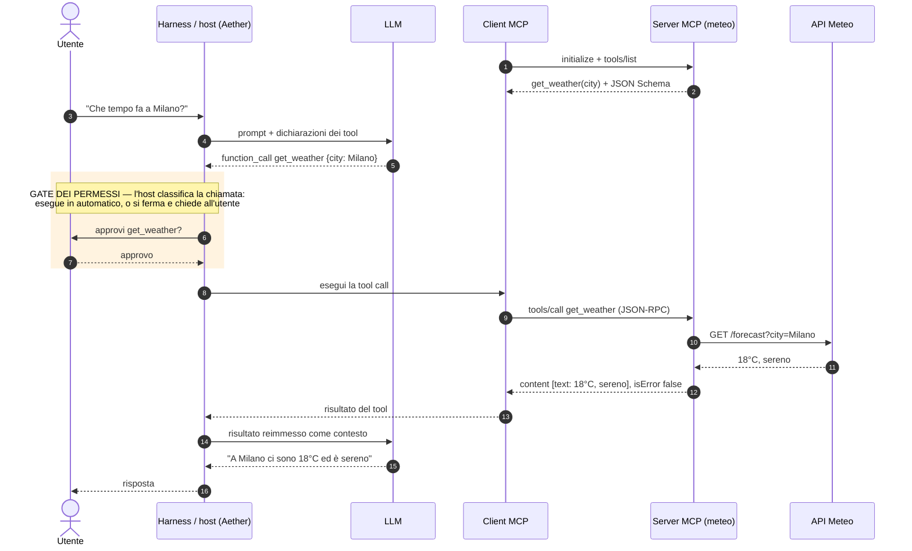
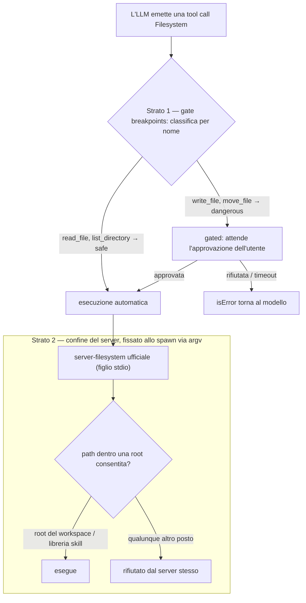
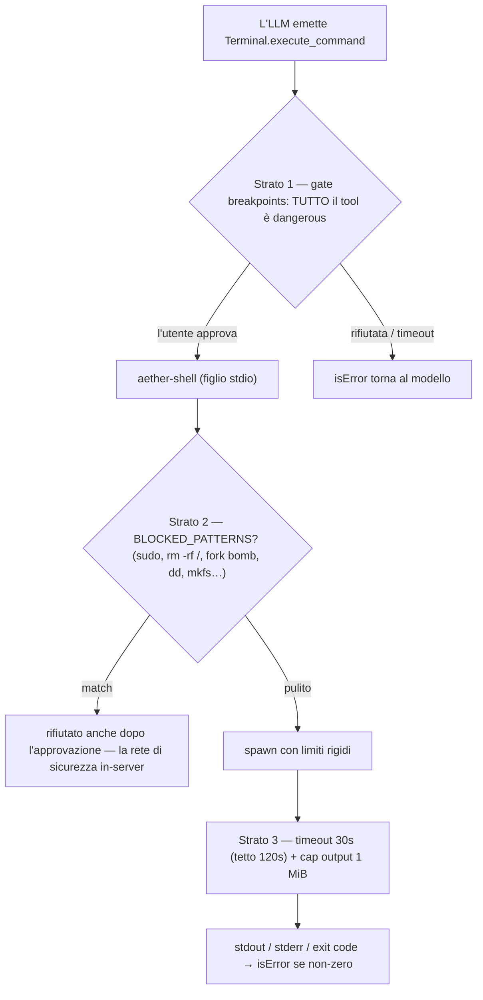
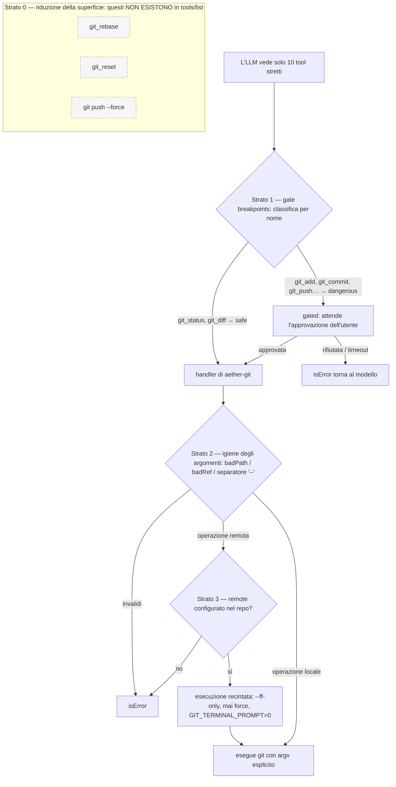

# I server MCP builtin — approfondimento

> 🇮🇹 Traduzione derivata — la versione di riferimento è quella inglese: [Built-in MCP servers](../../guides/builtin-mcp.md).

Cosa copre: come i tre tool preconfezionati — Filesystem, Terminal, Git — sono implementati come server MCP, le tre strategie implementative diverse che incarnano, il loro ciclo di vita (pooling per-root, eviction LRU) e come funziona davvero il modello di sicurezza a strati. Si apre con un'introduzione al protocollo (§1) e una checklist di best practice MCP (§2) a cui il resto della guida rimanda di continuo. Leggilo quando vuoi capire i builtin oltre la panoramica di [MCP tools](mcp-tools.md), o prima di aggiungerne un quarto.

## 1. MCP in due parole

Il **Model Context Protocol** è un protocollo aperto (introdotto da Anthropic a fine 2024, poi adottato da tutta l'industria) che standardizza il modo in cui un'applicazione LLM parla con fornitori esterni di capacità. Prima di MCP ogni assistente integrava ogni tool con colla su misura; con MCP un server scritto una volta funziona con qualunque host conforme. Tre ruoli:

- **Host** — l'applicazione LLM (Aether, Claude Code, un assistente in IDE). Decide *quali* server connettere e *quando* un tool può girare.
- **Client** — l'oggetto-connessione posseduto dall'host, uno per server (in Aether: `StdioMcpConnection` / `HttpMcpConnection`).
- **Server** — un processo o un endpoint che espone capacità. Non sa nulla del modello; risponde e basta.

Il formato sul filo è **JSON-RPC 2.0** su un transport: **stdio** (l'host spawna il server come processo figlio e scambia JSON delimitato da newline su stdin/stdout — il transport usato da tutti e tre i builtin) oppure **streamable HTTP** (un endpoint remoto; ciò che configura il dialog "Add Connection" di Aether). Una sessione parte con un handshake — `initialize` (versione del protocollo + negoziazione delle capability) seguito dalla notifica `notifications/initialized` — e poi parla le primitive:

- **Tools** — funzioni che il *modello* decide di invocare, ognuna descritta da nome, descrizione in linguaggio naturale e JSON Schema degli argomenti. Scoperte con `tools/list`, invocate con `tools/call`.
- **Resources** — dati che l'*host* legge e inietta come contesto (file, tabelle, documenti).
- **Prompts** — template invocati dall'utente (la primitiva "slash command").

Il client di Aether — come la maggior parte degli host agentici oggi — usa **solo la primitiva tools**: `mcp.schema.ts` valida esattamente `tools/list` e `tools/call`, nient'altro. È un taglio di scope deliberato, non un incidente storico.

Un modello mentale conta più di tutti gli altri: **il risultato di un tool è dato per il modello, non una risposta API per il codice**. I risultati sono blocchi `content` (di solito testo) più un flag `isError`. `isError: true` significa "l'operazione è fallita in un modo che il modello deve leggere e a cui deve reagire" (file non trovato, exit code 1, bloccato dalla policy) — distinto da un errore *di protocollo* JSON-RPC, che significa che la chiamata stessa era malformata. I server ben progettati riservano gli errori di protocollo ai problemi di protocollo e riportano i fallimenti di dominio come contenuto, così il loop agentico può recuperare invece di schiantarsi.

Ecco il giro completo sull'esempio canonico — un tool meteo. Due cose da notare: **l'LLM non parla mai col server MCP** (emette solo un'*intenzione*; è l'host a eseguire), e il **gate dei permessi vive nell'host**, tra l'intenzione del modello e la chiamata reale — motivo per cui funziona identico per ogni server, inclusi quelli che non hai scritto tu:



## 2. Best practice — e dove i builtin le applicano

Una checklist distillata dall'esperienza collettiva dell'ecosistema MCP. Ogni voce indica la sezione in cui i builtin di Aether la mettono in pratica — il resto della guida è, in un certo senso, questa tabella espansa.

| # | Best practice | Perché | Dove in Aether |
|---|---|---|---|
| 1 | **Least privilege per costruzione** — limita il server al set minimo di capacità che basta al lavoro; passa i confini allo spawn, non come check a runtime | Un server che non riceve mai una capacità non può essere convinto a usarla | Filesystem riceve le root consentite come argv (§5); i tool git operano solo sui remote configurati (§7) |
| 2 | **Tool stretti quando ci sono invarianti, tool generici solo dietro limiti duri** | N tool specifici codificano garanzie che una descrizione non può dare; un tool generico massimizza la superficie d'attacco | L'intero confronto Terminal↔Git (§6 vs §7) |
| 3 | **Le descrizioni sono prompt** — scrivile per il modello: dichiara limiti, default e rifiuti direttamente nella descrizione | La descrizione è l'unica "documentazione" che il modello vede al momento della decisione | `execute_command` dichiara timeout e cap; `git_push` dice "Never force" (§6, §7) |
| 4 | **Tratta gli argomenti come ostili** — valida i tipi, rifiuta valori a forma di flag, usa il separatore `--`, costruisci l'argv esplicitamente, mai interpolare in una stringa shell | Gli argomenti dei tool sono testo generato dal modello; la prompt injection ci arriva | `badPath()`, `badRef()`, `['add', '--', ...paths]` (§7) |
| 5 | **Delimita tutto** — timeout con tetto rigido, cap sull'output con marker di troncamento espliciti | Protegge l'event loop dell'host *e* il context window del modello | `SHELL_DEFAULTS`: 30s/120s, 1 MiB + `[output truncated]` (§6) |
| 6 | **I fallimenti di dominio sono contenuto `isError`, non errori di protocollo** | Il modello può leggere il fallimento e tentare altro; un errore di protocollo uccide lo scambio e basta | Ogni handler restituisce `{ isError, content }` — pattern bloccati, timeout, exit non-zero (§6, §7) |
| 7 | **Stato per-chiamata nella chiamata, stato di sessione nell'host** | I server stateless si poolano, riavviano e scalano banalmente | Terminal prende `cwd` per chiamata ed è un'unica istanza globale; è l'*host* a poolare le istanze fs/git rooted (§6, §8) |
| 8 | **L'autorizzazione vive nell'host, non nel server** | Un gate fuori dai server compone su tutti — inclusi i server che non hai scritto tu | Il gate breakpoints classifica e gata ogni chiamata, builtin o custom (§9) |
| 9 | **Emetti output stabile e parsabile dalle macchine** | Il modello impara la forma una volta e smette di indovinare | `git status --porcelain=v2`; il layout fisso `stdout/---/stderr/---/exit` (§6, §7) |
| 10 | **Nomina i tool in modo prevedibile** — i nomi sono superficie d'API: classificazione, policy e UI keyano tutti sui nomi | Un tool ben nominato si classifica per rischio senza eseguirlo | `DANGEROUS_NAME_PATTERNS` lavora solo sui nomi qualificati (§9) |

## 3. L'idea di fondo: mangiare il proprio protocollo

Aether è un *client* MCP: parla JSON-RPC con server esterni via stdio o HTTP. I tre tool preconfezionati riusano esattamente quell'infrastruttura invece di aggiungerne una parallela: sono **normali server MCP stdio che Aether spawna da solo**. Niente percorso privilegiato, niente API interna — dal punto di vista del registry sono server come gli altri. Le uniche differenze: l'`id` inizia per `builtin:` e la config non viene dal context dell'utente ma viene **sintetizzata** da `BuiltinMcpStore` (`server/domain/mcp/builtin/builtin.store.ts`).

I tre incarnano **tre strategie implementative distinte**, ed è questo che li rende un buon caso di studio:

| | Strategia | Processo spawannato | Rooted per workspace |
|---|---|---|---|
| **Filesystem** | riusa il pacchetto ufficiale | `@modelcontextprotocol/server-filesystem` | sì |
| **Terminal** | server fatto in casa, 1 tool generico | `server/mcp/builtin/aether-shell.ts` | **no** (globale) |
| **Git** | server fatto in casa, 10 tool chirurgici | `server/mcp/builtin/aether-git.ts` | sì |

## 4. La fabbrica di config: `BuiltinMcpStore`

Lo stato persistente è minimale — una tabella SQLite `builtin_mcp_state` con tre righe (`transport`, `enabled`, `fs_root`). Il lavoro interessante è in `toConfigs()` / `rootedConfigs()`, che trasformano quelle righe in `McpServerConfig` stdio già pronti per il registry:

```ts
{
  id: 'builtin:git@/path/del/workspace',   // ← l'id incorpora la root!
  transport: 'stdio',
  command: process.execPath,               // il node corrente
  args: [...resolveAetherGitArgs(), root],
  env: builtinNodeEnv(),
}
```

Tre dettagli valgono da soli il tutorial:

**a) `command: process.execPath`, mai `"node"`.** Il figlio usa lo *stesso* runtime del padre, qualunque sia — cruciale in Electron, dove l'eseguibile è l'app stessa. Da qui `builtinNodeEnv()`: se `process.versions.electron` esiste, inietta `ELECTRON_RUN_AS_NODE=1`, altrimenti lo spawn aprirebbe una seconda finestra GUI invece di un processo Node.

**b) Risoluzione dev/prod dell'entry.** In produzione esiste `dist/server/mcp/builtin/aether-shell.js` accanto al bundle; in dev esiste solo il sorgente `.ts`, e un figlio `node` non eredita il loader tsx del dev server padre — morirebbe con `ERR_UNKNOWN_FILE_EXTENSION`. Quindi `resolveAetherShellArgs()` restituisce `['--import', 'tsx', srcEntry]` in dev e `[distEntry]` in prod. Il classico problema "il child process non è il tuo processo".

**c) La root dentro l'id.** `builtin:filesystem@/home/x/progetto` non è cosmetica: è la chiave di pooling (§8).

Due note di design:

- Il pattern "config sintetizzata" tiene i builtin **fuori** da `context.mcpServers`: l'utente non può cancellarli o corromperli dal dialog MCP, e la UI li gestisce con toggle dedicati (`BuiltinMcpToggles`) invece che con le card generiche.
- Nota l'asimmetria voluta: Filesystem aggiunge sempre `libraryDir` (la cartella delle skill) alle root consentite, Git no. Le skill devono essere leggibili ovunque; ma non c'è motivo per cui l'agente faccia commit dentro la libreria.

## 5. Filesystem: comprare, non costruire

Per i file Aether non scrive una riga di logica di dominio: `resolveFilesystemServerEntry()` risolve con `require.resolve` l'entry del pacchetto **ufficiale** `@modelcontextprotocol/server-filesystem` e lo lancia con le root consentite come argv:

```
node …/server-filesystem/dist/index.js /root/del/workspace /path/libreria-skill
```

La sicurezza (path traversal, symlink escape, confinamento alle root) è delegata al pacchetto di riferimento del protocollo, mantenuto e testato altrove. La *strategia*: quando esiste un server MCP ufficiale maturo per il dominio, il valore che Aether aggiunge non è reimplementarlo ma **rootarlo per workspace** e classificarne i tool (§9).

Due strati indipendenti proteggono una chiamata Filesystem — il gate lato host decide *se* la chiamata parte, le root fissate allo spawn decidono *dove può arrivare*. Nota che il secondo strato non è un check a runtime fatto da Aether: il server è *nato* incapace di uscire dalle sue root (best practice n. 1):



## 6. Terminal: il server minimale fatto in casa

`aether-shell.ts` (100 righe) dimostra quanto poco sia un server MCP stdio: un loop che accumula stdin, spezza per newline, fa `JSON.parse`, e risponde a tre metodi — `initialize`, `tools/list` (un solo tool, `execute_command`), `tools/call`. Fine del protocollo.

La parte di valore è separata in `aether-shell.handler.ts`, e questa **separazione protocollo/handler è la scelta architetturale chiave**: `executeCommand()` è una funzione pura async testabile con Vitest *in-process*, senza spawnano il server né parlare JSON-RPC. I test del protocollo e i test della logica sono file diversi.

L'handler applica tre difese, nell'ordine:

1. **Pattern block** (`BLOCKED_PATTERNS` in `builtin.types.ts`): `sudo`, `rm -rf /`, fork bomb, `dd if=`, `mkfs.*`, scritture su `/dev/sd*`, `chmod -R 777 /`. Se matcha, il comando non parte proprio — `isError: true` col pattern citato.
2. **Timeout**: default 30 s, tetto rigido 120 s anche se il modello ne chiede di più (`Math.min`), escalation SIGTERM → SIGKILL dopo 500 ms.
3. **Output cap**: 1 MiB per stream (stdout e stderr separatamente), con marker `[output truncated]` — protegge il *context window* del modello, non solo la memoria.

L'output ha un formato fisso `stdout\n---\nstderr\n---\nexit code: N`, così il modello impara una struttura stabile. E naturalmente `windowsHide: true` sullo spawn (la regola nata dal fix 0.1.24).

Terminal è anche l'unico builtin **avviato al boot** (`bootstrap()` chiama `startBuiltin('terminal')`) e **mai rooted**: un solo processo globale, id `builtin:terminal`, perché il `cwd` è un argomento per-chiamata del tool, non una proprietà dell'istanza.

Essendo il tool generico, gli strati si impilano diversamente rispetto a Filesystem: l'*intero* tool è classificato dangerous, quindi **ogni** chiamata attende l'utente — e la blocklist in-server sta *dietro* l'approvazione, a catturare ciò che non deve girare **nemmeno se un umano ha detto sì** (un click distratto su "approva" per `sudo rm -rf /` continua a non fare nulla):



## 7. Git: tool chirurgici invece di una shell

La scelta più interessante è cosa Git **non** è: non è `execute_command` con prefisso `git`. Sono **10 tool a firma stretta** (`git_status`, `git_diff`, `git_add`, `git_commit`, `git_checkout`, `git_restore`, `git_fetch`, `git_push`, `git_pull`, `git_merge`), ognuno mappato a un handler che costruisce l'argv esplicitamente. Le strategie difensive in `aether-git.handler.ts`:

- **Igiene degli argomenti**: `badPath()` rifiuta path vuoti o che iniziano con `-` (niente injection di flag tipo `--upload-pack`), e ogni lista di path passa dopo il separatore `--` (`['add', '--', ...paths]`), quindi un file chiamato `-rf` resta un file.
- **Operazioni remote recintate**: `gitFetch/Push/Pull` verificano che il remote sia tra quelli **configurati nel repo** (`configuredRemotes`) — l'agente non può pushare verso un URL arbitrario. `GIT_TERMINAL_PROMPT=0` impedisce che git si blocchi in attesa di credenziali interattive.
- **Niente riscritture di storia**: `git_pull` e `git_merge` sono hardcoded `--ff-only`; `git_push` "Never force" (dalla description del tool); `git_rebase` e `git_reset` semplicemente non esistono.
- **Output parsabile**: `git_status` usa `--porcelain=v2 --branch`, il formato pensato per le macchine.

Il confronto Terminal↔Git è la lezione: **un tool generico compra flessibilità pagando in superficie d'attacco; N tool specifici comprano invarianti** (qui: "la storia non si riscrive mai") **pagando in manutenzione**. Aether li usa entrambi — l'agente *potrebbe* fare `git rebase` via Terminal, ma lì casca nel gate dei breakpoint (§9), che è il punto.

Git mostra la forma più forte di sicurezza: **lo strato 0 è ciò che il modello non può nemmeno chiedere**. `git_rebase`, `git_reset` e il force-push non sono gated né bloccati — semplicemente *non esistono* in `tools/list`, quindi nessuna prompt injection può invocarli attraverso questo server. Gli strati sotto arricchiscono quella prima rete:



## 8. Ciclo di vita: pooling per-root con eviction LRU

Il registry (`server/domain/mcp/registry.ts`) gestisce i builtin rooted come un pool:

- A ogni dispatch, **subito prima di eseguire un tool**, `ensureRootedBuiltins(root)` spawna (se non già vive) le istanze `builtin:filesystem@<root>` e `builtin:git@<root>` per il workspace della sessione — lazy, così ereditano sempre la root giusta anche se l'utente l'ha appena cambiata.
- Una lista `rootedLru` tiene le root in ordine most-recently-used; oltre il tetto (`AETHER_BUILTIN_POOL_MAX`, default 8) la root meno usata viene sfrattata e i suoi due processi chiusi. Lavorare su molti workspace non accumula processi zombie.
- `invalidateRootedBuiltins()` svuota il pool quando cambia la root di default — il prossimo dispatch rispawna tutto con la config corrente.

C'è poi il problema dei **duplicati**: possono coesistere più istanze fs/git (una per root, più un'eventuale globale). `listLiveTools(root)` lo risolve in due modi a seconda del chiamante: col root (percorso di dispatch) filtra *esattamente* l'istanza di quella root; senza root (la UI delle policy) dedupe per `qualifiedName`, perché la UI keya le righe per `Filesystem.read_file`, non per serverId.

Il `qualifiedName` è la convenzione che lega tutto: `<serverName>.<toolName>` → `Filesystem.read_file`, `Terminal.execute_command`, `Git.git_push`.

## 9. La sicurezza è a strati — i pattern block non sono il gate

È il punto concettuale più importante. I `BLOCKED_PATTERNS` fermano solo la catastrofe ovvia; la vera governance è nel **BreakpointService**, fuori dai server:

1. `classifyTool()` (`breakpoints/classify.ts`) assegna una categoria per euristica sul nome: `DANGEROUS_NAME_PATTERNS` marca `*.execute_command`, `*.write_*/delete_*/…`, e `*.git_(push|commit|checkout|pull|merge|…)` come **dangerous**; il resto è **safe**. L'utente può fare override per-tool dalla UI.
2. La policy per categoria (Safe→`auto`, Dangerous/External→`gate` di default) decide se il tool parte da solo o si ferma in chat ad **aspettare la tua approvazione** (timeout 24h).
3. Per i tool gated, il `PreviewService` genera un'anteprima dell'effetto (`DANGEROUS_SHELL_PATTERNS` — `git push --force`, `npm publish`, `git reset --hard`, … — serve proprio a evidenziare i comandi shell rischiosi nel preview).

Quindi: il server builtin è *capace* di fare la cosa pericolosa; è il livello sopra che chiede il permesso. I pattern in-server sono solo la rete di sicurezza per ciò che non deve succedere *nemmeno con approvazione*.

Due osservazioni:

- La classificazione avviene sul **nome qualificato**, non sul contenuto — ed è il motivo per cui i tool git sono chirurgici. `Git.git_push` è riconoscibile e gateabile come nome; lo stesso push dentro `Terminal.execute_command` è gateabile solo perché `execute_command` è dangerous *in blocco*.
- È lo stesso identico gate che attraversano le tool call quando il provider è un CLI agentico che rientra dal bridge MCP loopback: la stratificazione ripaga perché è indipendente da *chi* invoca il tool.

## 10. Ricetta: aggiungere un quarto builtin

Se domani volessi un builtin "Database", il percorso tracciato dai tre esistenti è:

1. **Decidi la strategia**: esiste un server MCP ufficiale maturo? → strada Filesystem. Dominio con invarianti da difendere? → strada Git (tool stretti). Serve genericità? → strada Terminal (un tool + limiti duri).
2. Se fatto in casa: `server/mcp/builtin/aether-db.ts` (loop JSON-RPC, ~100 righe copiabili da aether-shell) + `aether-db.handler.ts` (logica pura, testata in-process).
3. Migration **append-only** che aggiunge la riga `('db', 0, NULL)` a `builtin_mcp_state` (mai toccare le migration esistenti — `012_builtin_git.sql` mostra come si è aggiunto `git`).
4. `BuiltinTransport` += `'db'`, ramo in `toConfigs()`/`rootedConfigs()` (con la scelta consapevole: rooted o globale?), `resolveAetherDbArgs()` col doppio percorso dev/prod, `windowsHide` e `builtinNodeEnv()`.
5. Toggle in `BuiltinMcpToggles`, e pattern in `DANGEROUS_NAME_PATTERNS` se i nomi dei tool non matchano già le euristiche.

Il tutto senza toccare dispatch, breakpoints o UI delle policy: è la ricompensa dell'aver fatto dei builtin dei server MCP qualunque.

## File chiave

- `server/domain/mcp/mcp.schema.ts` — la superficie di protocollo lato client (`tools/list`, `tools/call`)
- `server/domain/mcp/builtin/builtin.store.ts` — sintesi delle config, risoluzione entry dev/prod, gestione Electron
- `server/domain/mcp/builtin/builtin.types.ts` — `BLOCKED_PATTERNS`, `SHELL_DEFAULTS`
- `server/mcp/builtin/aether-shell.ts` / `aether-shell.handler.ts` — server e handler Terminal
- `server/mcp/builtin/aether-git.ts` / `aether-git.handler.ts` — server e handler Git
- `server/domain/mcp/registry.ts` — pooling per-root, eviction LRU, listing/dedup dei tool
- `server/domain/mcp/breakpoints/classify.ts` + `breakpoints.types.ts` — classificazione per nome, pattern di pericolo

## Vedi anche

- [MCP tools](mcp-tools.md) — la panoramica: connessione dei server, cap sulle chiamate, wiring nel dispatch
- [Breakpoints](breakpoints.md) — il gate di approvazione che ogni tool call attraversa
- [Workspaces](workspaces.md) — da dove arrivano le root
