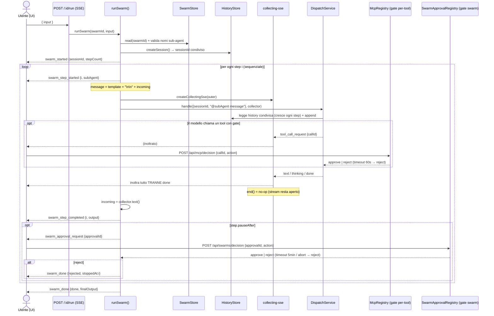

# Swarm in Aether — funzionamento

> Come sono implementate e come funzionano le "swarm" di Aether. Basato su
> `server/domain/swarms/*` (orchestratore, store, approval), `server/lib/collecting-sse.ts`,
> `server/routes/swarms.routes.ts`, `src/hooks/useSwarmRun.ts` e la spec di design
> `docs/superpowers/specs/2026-05-29-slice-25-swarms-design.md` (Slice 25).

---

## Premessa: "swarm" è un nome fuorviante

Nonostante il nome, **non è uno sciame parallelo**. È una **pipeline lineare e
sequenziale di sub-agent** — del tipo `architect → coder → qa` — dove l'output
testuale di uno step diventa l'input del successivo. La spec lo dichiara
esplicitamente: *"an ordered, linear sequence of sub-agent invocations"*.
Topologia parallela / branching / DAG è esplicitamente **fuori scope v1**.

---

## Modello dati

Due tabelle relazionali (migration `server/db/migrations/011_swarms.sql`),
niente YAML:

```ts
interface SwarmStep {
  subAgentName: string;    // riferimento per NOME a un sub-agent (non FK)
  promptTemplate: string;  // testo fisso premesso all'input ('' = nessuno)
  pauseAfter: boolean;     // gate human-in-the-loop dopo questo step
}
interface SwarmRecord { id; name; steps: SwarmStep[]; createdAt; updatedAt; }
```

Gli step sono ordinati per `position` (`UNIQUE (swarm_id, position)`). Il
`subAgentName` **non** è una foreign key: i sub-agent sono indirizzati per nome
via `@mention` (come in chat) e un nome può essere (ri)creato dopo. La validità
si verifica **all'avvio del run**, non a schema.

---

## Il loop di orchestrazione

Cuore in `swarm.orchestrator.ts` — `runSwarm(deps, {swarmId, input}, sse, signal)`:

1. **Carica e valida** lo swarm: errore se assente, se ha 0 step, o se un
   `subAgentName` non esiste tra i sub-agent noti (`subAgentsStore.list()`).
   Fail-fast con `swarm_error` + `swarm_done {error}`.
2. **Crea UNA nuova sessione** di chat (`createSession()`) intitolata allo
   swarm → emette `swarm_started {sessionId, swarmName, stepCount}`. Il
   transcript sarà visibile nella UI come una chat normale.
3. **Itera gli step** in ordine, con una variabile `incoming` (inizializzata
   con l'`input` del run):
   - `swarm_step_started {position, subAgent}`
   - costruisce il messaggio:
     `promptTemplate ? template + "\n\n" + incoming : incoming`
   - **riusa interamente il dispatch loop della chat**:
     `dispatcher.handle({ sessionId, message: "@<subAgent> <message>" }, collector, signal)`.
     Cioè ogni step è letteralmente un dispatch `@subagent ...` nella sessione
     condivisa.
   - se il dispatch ha emesso un evento `error` (il dispatch **non lancia**) →
     `swarm_error {position}` + `swarm_done {error}`, stop.
   - `incoming = collector.text()` (l'output dello step) →
     `swarm_step_completed {position, output}`
   - se `step.pauseAfter` → gate di approvazione swarm-level (sotto).
4. A fine ciclo: `swarm_done {status:'done', finalOutput: incoming}`.

`DispatchService.handle` soddisfa già l'interfaccia `SwarmDispatcher` senza
modifiche: la swarm non reimplementa nulla del flusso provider/tool/breakpoint.
Ogni step eredita streaming, tracer, gate per-tool, persistenza history.
L'orchestratore è puro e testabile: tutte le dipendenze (store, dispatcher,
createSession, approvals) sono iniettate.

---

## Il trucco chiave: `collecting-sse`

Il dispatch è progettato per scrivere su uno stream SSE e **chiuderlo** alla
fine (`sse.end()`). Ma in una swarm ci sono N dispatch consecutivi su **un
solo** stream SSE verso il browser. La soluzione è `createCollectingSse(outer)`
(`server/lib/collecting-sse.ts`), un adapter che avvolge lo stream per la durata
di uno step:

- **accumula** i chunk `text` in un buffer (→ `collector.text()` = output dello step);
- **registra** eventuali `error` (il dispatch segnala i fallimenti come evento,
  non come throw → `collector.capturedError()`);
- **inoltra ogni evento TRANNE `done`** allo stream esterno (così la UI vede
  testo, thinking, reasoning step e i gate per-tool in tempo reale);
- **`end()` è un no-op**: la fine del turno interno non deve chiudere lo stream
  della swarm.

È il pezzo che permette di "incollare" più dispatch su un'unica connessione
mantenendola aperta tra uno step e l'altro.

---

## Sessione condivisa → conseguenza sul context consumption

**Tutti gli step girano nella stessa `sessionId`**, e ogni dispatch *appende*
user+model alla history. Quindi:

- lo step 2 vede nella sua `history` i messaggi degli step 0 e 1 (la history
  cresce a ogni step);
- **inoltre** l'output dello step 1 viene passato *anche esplicitamente* dentro
  il messaggio dello step 2 (`incoming`).

→ L'output di uno step finisce **due volte** nel contesto dello step successivo:
una come messaggio model nella history, una incorporato nel nuovo user message.
Combinato con il fatto che la history non viene mai potata (vedi
[`context_consumption.md`](./context_consumption.md)), **il consumo di token in
una swarm cresce più rapidamente** di N dispatch indipendenti. Ogni step cambia
il `@mention` → cambia il blocco sub-agent del system instruction, ma la history
accumulata resta condivisa tra sub-agent diversi.

---

## I due livelli di gate (human-in-the-loop)

Una swarm ha **due meccanismi di approvazione distinti e indipendenti**, su
livelli di annidamento diversi.

### 1. Gate per-tool (dentro uno step) — Slice 22 breakpoints

Avviene **durante** il dispatch di uno step, quando il modello chiede di
eseguire un tool MCP. In `DispatchService.gateExecuteAndTrace`:

- `BreakpointService.resolveDecision()` decide `auto` o `gate` in base alla
  policy del tool (`autoApprove`) o, in assenza, alla classificazione della
  categoria del tool (`classifyTool` → policy per categoria).
- se `gate` → `mcpRegistry.awaitDecision(callId, 60_000)` **blocca** fino alla
  decisione utente.
- **Canale**: evento `tool_call_request` (inoltrato dal `collecting-sse`);
  risposta via `POST /api/mcp/decision { callId, action }`.
- **Timeout 60 s** → `awaitDecision` lancia `decision timeout`, intercettato con
  `.catch(() => 'reject')`. Un reject produce un *tool result* di errore che
  torna al modello: **lo step continua**, non muore il run.
- ID: `callId` (UUID per chiamata).

### 2. Gate swarm-level (tra gli step) — `pauseAfter`

Avviene **dopo** che il dispatch di uno step è terminato, se
`step.pauseAfter === true`. In `runSwarm`:

- emette `swarm_approval_request { approvalId, position, output }` con
  `approvalId = "${swarmId}:${i}"`.
- `SwarmApprovalRegistry.awaitDecision(approvalId, timeout, signal)` **blocca**.
- **Canale**: evento `swarm_approval_request`; risposta via
  `POST /api/swarms/decision { approvalId, action }`.
- **Timeout 5 min** (default) → `reject`. Anche l'**abort** del signal → `reject`.
- `reject` → `swarm_done {status:'rejected', stoppedAt:i}`: **ferma l'intero run**.
- ID: `"${swarmId}:${position}"`.

### Come interagiscono

| Aspetto | Gate per-tool | Gate swarm-level |
|---|---|---|
| Quando | *durante* il dispatch di uno step | *dopo* il dispatch di uno step |
| Registry | `McpRegistry.decisions` | `SwarmApprovalRegistry.pending` |
| ID | `callId` (UUID) | `${swarmId}:${position}` |
| Route di risposta | `POST /api/mcp/decision` | `POST /api/swarms/decision` |
| Timeout | 60 s | 5 min (default) |
| Legato al signal di abort | no (solo timer) | sì (abort → reject) |
| Effetto del reject | il *tool* fallisce, lo step continua | l'intero run si ferma |

Punti chiave dell'interazione:

- **Annidamento, mai sovrapposizione.** I gate per-tool stanno *dentro*
  `handle()`; il gate swarm-level scatta *dopo* che `handle()` è ritornato. Per
  un dato step l'ordine è sempre: 0+ gate per-tool risolti → step completato →
  (eventuale) gate swarm-level. Non possono essere pendenti contemporaneamente
  **per lo stesso step**.
- **Stesso stream SSE, due tipi di richiesta.** Grazie al `collecting-sse`, i
  `tool_call_request` di uno step vengono inoltrati sulla stessa connessione su
  cui poi arriva `swarm_approval_request`. La UI deve quindi gestire **entrambi**
  distinguendoli per evento/ID e rispondere sulla route giusta.
- **Severità asimmetrica.** Un gate per-tool ignorato (timeout 60 s) degrada
  solo quella chiamata a errore e lascia proseguire lo step; un gate swarm-level
  ignorato (timeout 5 min) **uccide il run**.
- **Disconnessione del client.** `res.on('close')` → abort del signal. Il gate
  swarm-level si risolve subito a `reject` (è bound sul signal); il gate
  per-tool eventualmente pendente non è legato al signal e si chiude solo al suo
  timeout di 60 s.

---

## Sequence diagram



---

## Caratteristiche e limiti (v1)

- **Run effimeri**: nessuna tabella di run/run-step. Il run vive sulla
  connessione SSE aperta; il transcript è la sessione di chat. Chiudere la
  connessione → abort (`swarm_done {interrupted}`).
- **Una sessione nuova per ogni run** (non si rilancia su una sessione esistente).
- **Solo lineare**: niente parallelo, branching, condizionali, variabili
  nominate tipo `{{architect.output}}`, né import/export YAML.

### Vocabolario eventi SSE (swarm-level)

`swarm_started`, `swarm_step_started`, `swarm_step_completed`,
`swarm_approval_request`, `swarm_error`, `swarm_done` — più gli eventi per-agent
inoltrati (`text`, `thinking`, `reasoning_step`, `tool_call_request`,
`tool_call_started`, `tool_call_progress`, `tool_call_result`).
